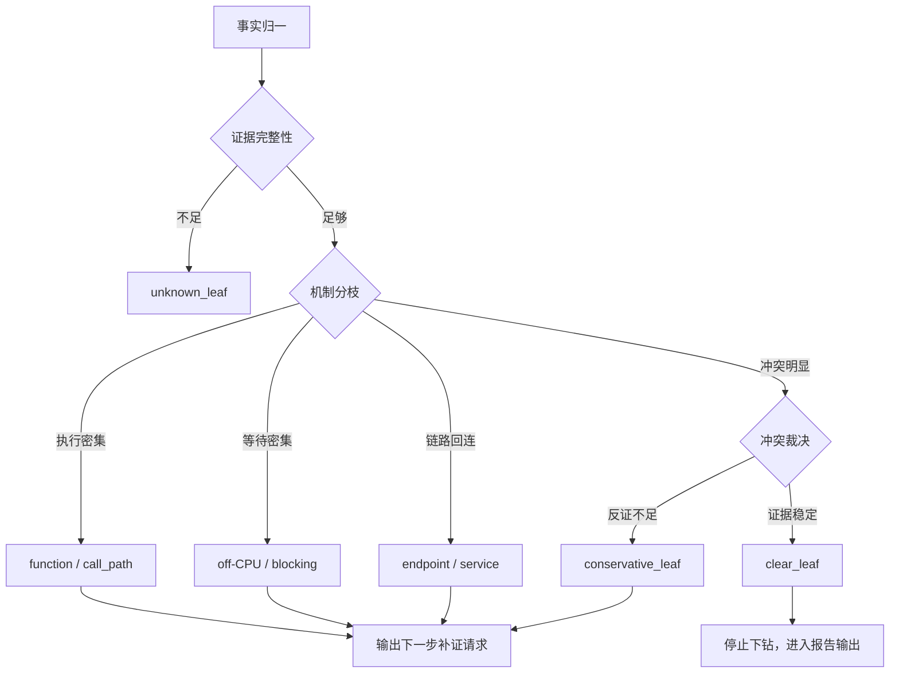
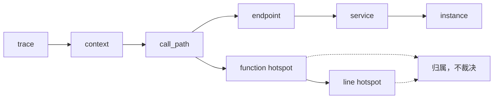

# Evidence-to-Attribution Analyzer 方案

## 1. 背景与问题

当前系统已经具备采集端能力，且采集结果已经结构化。Analyzer 当前需要解决的问题不是“如何采集更多数据”，而是：

- 如何基于已有结构化数据完成智能分析。
- 如何从现象定位到资源、进程、线程、函数或调用路径。
- 如何区分主因、次因、伴随现象和不支持结论。
- 如何避免 AI 在证据不足时强行归因。
- 如何让最终 RCA 报告中的每个判断都能对应到具体证据。

因此，本方案聚焦 Analyzer 的数据处理、归因和定位链路，不涉及采集端改造。

## 2. 当前链路问题

当前分析链路可以概括为：

```text
结构化数据
  -> 生成候选原因
  -> 候选原因打分
  -> LLM 输出 RCA 报告
```

这个链路的问题不在于“假设验证”本身完全错误，而在于候选原因出现得太早。

一旦系统先生成多个候选原因，后续分析就容易变成：

```text
假设 A：CPU hotspot
假设 B：IO bottleneck
假设 C：memory pressure

然后从数据里找最匹配的假设。
```

这种方式存在几个风险：

- 容易让 AI 围绕候选原因讲故事。
- 容易在证据不足时也输出一个最像的 root cause。
- 容易把伴随现象误判成主因。
- 容易把“当前采样窗口内观察到的热点”扩大解释成“业务逻辑缺陷”。
- 结论边界不清晰，用户难以判断哪些是事实，哪些是推断。

## 3. 核心设计思想

本方案将 Analyzer 从 Hypothesis Validation 调整为 Evidence-to-Attribution，并将它设计为独立于 RCA 策略的分析链路。

核心区别是：

```text
原链路：先有嫌疑人，再找证据。
新链路：先看证据能证明到哪，再决定有没有嫌疑人。
```

新链路的核心问题不是：

```text
哪个候选 root cause 分数最高？
```

而是：

```text
当前数据最多允许 Analyzer 输出什么级别的定位结论？
```

因此 Analyzer 的主流程应从“候选原因竞争”变成“证据状态推进”。

这里需要区分两个维度：

| 维度 | 参数 | 可选值 | 作用 |
|---|---|---|---|
| 候选组织策略 | `analysis_strategy` | `linear` / `graph` | 决定候选原因如何生成、排序或重排 |
| 分析处理链路 | `analysis_pipeline` | `legacy` / `evidence_to_attribution` | 决定是否启用事实、现象、定位边界和证据反问 |

也就是说：

```text
linear / graph 不是新旧链路切换。
legacy / evidence_to_attribution 才是新旧 Analyzer 处理链路切换。
```

```text
Raw Facts
  -> Evidence State
  -> Symptom State
  -> Localization State
  -> Attribution State
  -> Evidence Challenge
  -> Explanation
```

外部方法论上，这个方向参考了三个原则：

- Brendan Gregg 的 USE Method：性能分析应围绕资源的 Utilization、Saturation、Errors 展开，而不是无方向地看指标。
- Google SRE 中 symptom 与 cause 的区分：现象和原因必须分层，不应混写。
- LLM hallucination 的通用控制原则：模型必须被约束在已有证据范围内，允许输出“不足以判断”。

参考资料：

- [The USE Method](https://www.brendangregg.com/usemethod.html)
- [Performance Analysis Methodology](https://www.brendangregg.com/methodology.html)
- [Google SRE - Monitoring Distributed Systems](https://sre.google/sre-book/monitoring-distributed-systems/)
- [Why language models hallucinate](https://openai.com/index/why-language-models-hallucinate/)

## 4. 新旧链路区别

| 维度 | 原假设验证链路 | Evidence-to-Attribution 链路 |
|---|---|---|
| 分析起点 | 候选原因 | 数据事实 |
| 推理方向 | 原因假设 -> 数据匹配 | 数据事实 -> 现象 -> 定位 -> 归因 |
| 核心问题 | 哪个假设最像 | 当前证据能证明到哪一层 |
| 证据作用 | 给候选原因加分 | 决定结论是否允许出现 |
| 输出倾向 | 选出一个 root cause | 输出主因、次因、伴随现象、无法归因 |
| AI 角色 | 参与归因和解释 | 主要负责解释受约束的分析结构 |
| 失败结果 | 低置信度原因 | 明确输出证据不足或只能定位到某层 |

当前实现中，新旧链路通过 `analysis_pipeline` 切换：

| `analysis_pipeline` | 实际链路 | 行为 |
|---|---|---|
| `legacy` | `evidence -> candidates -> calibrate -> LLM` | 保留旧版假设验证，不生成 `analysis_result` |
| `evidence_to_attribution` | `evidence -> analysis_result -> candidates -> calibrate -> constrained LLM` | 启用事实、现象、定位边界、证据反问和原因过滤 |

默认值为：

```text
analysis_pipeline=evidence_to_attribution
```

示例：

```text
输入事实：
- CPU user utilization 高
- perf top 中函数 foo 占比 38%
- iowait 低
- memory pressure 不明显

原链路可能输出：
- 根因是 foo 函数 CPU hotspot。

新链路应输出：
- 已确认现象：CPU user utilization 高。
- 已定位层级：function。
- 支持证据：perf top 中 foo 函数采样占比最高。
- 反向证据：iowait 低，不支持 IO wait bottleneck。
- 结论边界：可以判断主要瓶颈在 CPU 执行路径，但不能证明 foo 一定存在业务逻辑缺陷。
```

## 5. 总体架构

推荐总体链路如下：

```text
已格式化采集数据
  -> Fact Normalization
  -> Symptom Derivation
  -> Localization Derivation
  -> Attribution Guard
  -> Evidence Challenge
  -> Cause Composition
  -> Report Composition
```

各阶段职责如下：

| 阶段 | 输入 | 输出 | 主要职责 |
|---|---|---|---|
| Fact Normalization | 已格式化采集数据 | 标准事实项 | 把不同来源的数据转成统一事实 |
| Symptom Derivation | 标准事实项 | 异常现象 | 判断发生了什么性能现象 |
| Localization Derivation | 事实和现象 | 定位层级 | 判断最多能定位到哪一层 |
| Attribution Guard | 事实、现象、定位层级 | 可允许归因范围 | 控制哪些结论能出现 |
| Evidence Challenge | 可允许归因范围 | 证据必要性校验结果 | 判断缺少某条关键证据时结论是否仍成立 |
| Cause Composition | 归因范围和证据校验结果 | 主因、次因、伴随现象 | 组合最终归因结构 |
| Report Composition | 归因结构 | RCA 报告 | 用 AI 生成可读解释 |

## 6. 子模块设计

### 6.1 Fact Normalization

职责：

- 接收已有结构化采集结果。
- 不改变采集格式，只在 Analyzer 内部转换成统一事实模型。
- 为每条事实分配稳定的 `fact_id`。
- 标记事实来源、指标名、值、阈值、时间窗口和可信度。
- 对接近阈值的事实增加稳定性标记，避免轻微波动直接翻转结论。
- 将同类指标归一到统一事实表达，减少不同采集批次仅因字段顺序或命名差异导致的漂移。

示例事实：

```json
{
  "fact_id": "fact_cpu_user_high",
  "source": "sys_metrics",
  "metric": "cpu.user",
  "value": 91.2,
  "threshold": 80.0,
  "operator": ">=",
  "time_window": "task_window",
  "threshold_band": "above",
  "status": "observed"
}
```

该模块不做归因，只负责回答：

```text
现在有哪些事实成立？
```

### 6.2 Symptom Derivation

职责：

- 从事实项推导异常现象。
- 现象不是 root cause，只描述系统表现。
- 一个现象必须由一个或多个事实支持。

典型现象：

| 现象类型 | 示例 |
|---|---|
| CPU utilization high | CPU user/system 使用率高 |
| CPU saturation high | load average 或 run queue 高 |
| IO wait high | iowait 高、block IO latency 高 |
| memory pressure | page fault、swap、reclaim 明显 |
| function hotspot | perf top 或火焰图中某函数占比高 |
| syscall blocking | eBPF syscall 延迟高 |
| process concentration | 单进程占用异常集中 |

示例：

```json
{
  "symptom_id": "sym_cpu_util_high",
  "type": "cpu_utilization_high",
  "severity": "high",
  "supporting_facts": ["fact_cpu_user_high"]
}
```

该模块回答：

```text
这些事实说明发生了什么现象？
```

### 6.3 Localization Derivation

职责：

- 判断当前证据最多能定位到哪一层。
- 不急于下 root cause。
- 如果只能定位到资源层，就不应输出函数级根因。

定位层级：

| 层级 | 含义 | 示例 |
|---|---|---|
| resource | 资源层 | CPU、memory、disk、network |
| process | 进程层 | 某进程占用高 |
| thread | 线程层 | 某线程或 worker 异常 |
| syscall | 系统调用层 | read/write/futex 等阻塞 |
| function | 函数层 | 某函数采样占比高 |
| call_path | 调用路径层 | 某条调用链聚集明显 |

示例：

```json
{
  "localization_id": "loc_function_foo",
  "level": "function",
  "target": "foo",
  "supporting_symptoms": ["sym_function_hotspot"],
  "boundary": "localized_to_runtime_hotspot_not_business_defect"
}
```

该模块回答：

```text
当前数据最多能定位到哪一层？
```

### 6.4 Attribution Guard

职责：

- 控制哪些归因结论允许出现。
- 明确支持、削弱、缺失和禁止输出的归因。
- 防止 AI 根据弱证据扩大解释。

归因判断分为：

| 类型 | 含义 |
|---|---|
| supported | 有足够事实和现象支持 |
| weakened | 存在反向证据 |
| missing_evidence | 关键证据缺失 |
| forbidden | 当前证据不允许输出 |

示例：

```json
{
  "attribution_id": "attr_cpu_hotspot_supported",
  "cause_type": "cpu_hotspot",
  "status": "supported",
  "supporting_facts": ["fact_cpu_user_high", "fact_perf_foo_top"],
  "opposing_facts": ["fact_iowait_low"],
  "boundary": "can_claim_cpu_execution_bottleneck_only"
}
```

该模块回答：

```text
哪些归因可以说，哪些不能说？
```

### 6.5 Evidence Challenge

职责：

- 对每个允许输出的归因结论做证据必要性校验。
- 检查“如果移除某条证据，这个结论是否仍成立”。
- 进一步按证据族做剥离，而不只按单条事实做剥离，避免同一信号的不同表述重复放大置信度。
- 识别关键证据、辅助证据和冗余证据。
- 防止单条弱证据支撑过强结论。
- 防止多个证据其实都在表达同一件事，导致置信度被重复放大。

这个模块不是反事实分析，也不是重新构造另一个世界。它只在已有证据集合内做剥离校验：

```text
结论 C 是否成立？
  -> 去掉证据 E1 后是否仍成立？
  -> 去掉证据 E2 后是否仍成立？
  -> 只保留核心证据后是否仍成立？
```

校验结果分为：

| 类型 | 含义 |
|---|---|
| necessary | 去掉该证据后，结论必须降级或不能成立 |
| supportive | 去掉该证据后，结论仍成立，但置信度下降 |
| redundant | 去掉该证据后，结论基本不变 |
| misleading | 该证据容易导致错误放大，需要降低权重 |

示例：

```json
{
  "challenge_id": "challenge_cpu_hotspot_foo",
  "attribution_id": "attr_cpu_hotspot_supported",
  "tests": [
    {
      "removed_fact": "fact_perf_foo_top",
      "result": "downgrade_to_resource_level",
      "meaning": "缺少函数热点证据后，只能判断 CPU 压力，不能判断 foo 是热点"
    },
    {
      "removed_fact": "fact_cpu_user_high",
      "result": "forbid_cpu_bottleneck_claim",
      "meaning": "缺少 CPU 高这一事实后，不能输出 CPU 瓶颈结论"
    },
    {
      "removed_fact": "fact_load_high",
      "result": "confidence_down",
      "meaning": "缺少 load 高后，仍可判断 CPU 执行热点，但饱和程度证据变弱"
    }
  ],
  "critical_facts": ["fact_cpu_user_high", "fact_perf_foo_top"],
  "conclusion_stability": "stable_with_critical_facts_only"
}
```

该模块回答：

```text
这个结论到底依赖哪些关键证据？
如果某条证据不存在，结论需要降级到哪一层？
```

### 6.6 Cause Composition

职责：

- 只基于 Attribution Guard 允许的范围生成结论结构。
- 结合 Evidence Challenge 的结果判断结论是否稳定。
- 区分主因、次因、伴随现象和不支持原因。
- 不把所有异常都压成一个 root cause。
- 主因选择不依赖候选列表顺序，而依赖固定裁决顺序：更深定位层级优先、关键事实更多优先、反证更少优先，最后才按稳定的 `candidate_id` 兜底。
- 输出稳定性评分，标记该结论在重复任务中的收敛程度。

输出结构：

```json
{
  "primary_cause": {
    "cause_type": "cpu_hotspot",
    "target": "foo",
    "confidence": "high_possible",
    "stability_score": 0.92,
    "selection_reason": "function 层级更深且关键事实更多",
    "evidence": ["fact_cpu_user_high", "fact_perf_foo_top"],
    "critical_evidence": ["fact_cpu_user_high", "fact_perf_foo_top"]
  },
  "secondary_causes": [],
  "correlated_symptoms": ["sym_cpu_saturation_high"],
  "unsupported_causes": ["io_wait_bottleneck", "memory_pressure"]
}
```

该模块回答：

```text
最终应该如何组织主因、次因和伴随现象？
同类候选在重复任务中如何稳定选出同一个主因？
这个主因在重复任务中的收敛程度有多高？
```

### 6.7 Report Composition

职责：

- 使用 LLM 生成最终报告。
- LLM 在受约束归因范围内组织自然语言。
- LLM 不允许新增事实、不允许新增未出现的证据、不允许扩大归因范围。
- LLM 应优先沿用结构化分析给出的主因排序与稳定性评分，不得将次序重排为新的主因集合。
- 报告展开顺序固定为事实、现象、定位、证据链、关键证据反问、受约束归因、不支持的判断、结论边界、建议动作，避免同一结论因叙述顺序变化而显得不稳定。

报告应明确区分：

- 已观察事实。
- 已确认现象。
- 定位层级。
- 支持证据。
- 关键证据。
- 反向证据。
- 归因结论。
- 结论边界。
- 不支持的判断。

## 7. 数据结构设计

### 7.1 Fact

```json
{
  "fact_id": "string",
  "source": "string",
  "metric": "string",
  "value": "number|string|object",
  "threshold": "number|string|null",
  "operator": "string|null",
  "time_window": "string|null",
  "threshold_band": "below|near|above|unknown",
  "status": "observed|missing|invalid",
  "note": "string|null"
}
```

### 7.2 Symptom

```json
{
  "symptom_id": "string",
  "type": "string",
  "severity": "low|medium|high",
  "supporting_facts": ["fact_id"],
  "description": "string"
}
```

### 7.3 Localization

```json
{
  "localization_id": "string",
  "level": "resource|process|thread|syscall|function|call_path|line",
  "target": "string",
  "supporting_symptoms": ["symptom_id"],
  "supporting_facts": ["fact_id"],
  "boundary": "string"
}
```

### 7.4 Attribution

```json
{
  "attribution_id": "string",
  "cause_type": "string",
  "status": "supported|weakened|missing_evidence|forbidden",
  "supporting_facts": ["fact_id"],
  "opposing_facts": ["fact_id"],
  "missing_facts": ["string"],
  "confidence": "low|medium|high_possible",
  "boundary": "string"
}
```

### 7.5 Evidence Challenge

```json
{
  "challenge_id": "string",
  "attribution_id": "string",
  "tests": [
    {
      "removed_fact": "fact_id",
      "result": "unchanged|confidence_down|downgrade_level|forbidden",
      "meaning": "string"
    }
  ],
  "critical_facts": ["fact_id"],
  "critical_fact_groups": [["fact_id", "fact_id"]],
  "supportive_facts": ["fact_id"],
  "redundant_facts": ["fact_id"],
  "conclusion_stability": "stable|fragile|unsupported_without_key_fact"
}
```

### 7.6 Final Analysis

```json
{
  "facts": [],
  "symptoms": [],
  "localizations": [],
  "attributions": [],
  "evidence_challenges": [],
  "primary_cause": null,
  "stability_score": 0.0,
  "primary_cause_reason": "",
  "secondary_causes": [],
  "correlated_symptoms": [],
  "unsupported_causes": [],
  "conclusion_boundary": {
    "can_claim_root_cause": false,
    "max_supported_level": "resource|process|thread|syscall|function|call_path|line",
    "reason": "string"
  }
}
```

其中 `stability_score` 表示整份分析结果的整体稳定性，`primary_cause_reason` 是主因选择原因的摘要字段，应与 `primary_cause.selection_reason` 保持一致。

## 8. 分析流程

### 8.1 CPU 执行热点示例

输入：

```text
- CPU user 高
- load 高
- perf top 中 foo 占比最高
- iowait 低
- memory pressure 不明显
```

处理：

```text
Fact:
- CPU user utilization high
- load average high
- function foo hotspot observed
- IO wait low
- memory pressure not observed

Symptom:
- CPU utilization high
- CPU saturation high
- function hotspot

Localization:
- function: foo

Attribution:
- supported: cpu_hotspot
- weakened: io_wait_bottleneck
- weakened: memory_pressure

Evidence Challenge:
- 去掉 perf top 中 foo 占比最高这一事实后，结论降级为 CPU 资源压力，不能定位到 foo
- 去掉 CPU user 高这一事实后，不能输出 CPU 瓶颈结论
- 去掉 load 高这一事实后，仍可判断 CPU 执行热点，但饱和程度证据变弱

Conclusion:
- 主因：CPU 执行热点集中在 foo
- 关键证据：CPU user 高、perf top 中 foo 占比最高
- 边界：不能证明 foo 是业务逻辑缺陷，只能证明当前窗口内 CPU 消耗集中
```

### 8.2 IO 等待示例

输入：

```text
- CPU iowait 高
- block IO latency 高
- perf top 没有明显 CPU 热点
- 业务延迟升高
```

处理：

```text
Fact:
- IO wait high
- block IO latency high
- no dominant CPU hotspot

Symptom:
- IO wait high
- syscall or block layer delay

Localization:
- resource: disk/io
- syscall: read/write, if available

Attribution:
- supported: io_wait_bottleneck
- weakened: cpu_hotspot

Evidence Challenge:
- 去掉 block IO latency 高这一事实后，结论降级为 IO wait 现象，不能定位到 block layer 延迟
- 去掉 iowait 高这一事实后，不能输出 IO wait bottleneck
- perf top 无明显热点只能削弱 CPU hotspot，不能单独证明 IO 是主因

Conclusion:
- 主因：IO 等待导致任务延迟升高
- 关键证据：iowait 高、block IO latency 高
- 边界：如果没有具体 syscall 或 block target，只能定位到资源层
```

### 8.3 证据不足示例

输入：

```text
- CPU 稍高
- perf top 无明显热点
- IO 和内存指标正常
- 采样窗口较短
```

处理：

```text
Fact:
- CPU utilization medium
- no dominant hotspot
- IO normal
- memory normal

Symptom:
- weak CPU pressure

Localization:
- resource: CPU

Attribution:
- missing_evidence: cpu_hotspot
- weakened: io_wait_bottleneck
- weakened: memory_pressure

Evidence Challenge:
- 去掉 CPU 稍高这一事实后，剩余证据不能支持任何明确异常
- perf top 无明显热点不能作为 CPU hotspot 的支持证据
- 当前证据集合无法稳定支撑 root cause

Conclusion:
- 当前只能说明 CPU 存在轻度压力
- 不允许输出明确 root cause
```

## 9. AI 职责边界

AI 不是纯解释器，也不是自由归因器，而是“受证据边界约束的归因表达器”。

AI 可以做：

- 在 `allowed_cause_ids` 中选择最合适的主因表达。
- 组织主因、次因、伴随现象和结论边界的自然语言。
- 解释支持证据、反向证据和为什么只能定位到某一层。
- 在允许范围内补充排查建议，但不能突破已确认边界。

AI 不应该做：

- 新增输入数据中不存在的事实。
- 编造不存在的函数、进程、指标或调用链。
- 在 Attribution Guard 禁止时输出未被允许的归因。
- 把“可能”写成“确定”。
- 把“当前采样窗口内的现象”扩大成“长期系统缺陷”。
- 自动发起新的采集任务。

推荐约束：

```text
LLM 只能引用 facts、symptoms、localizations、attributions、evidence_challenges 中已有的 id。
LLM 可以在 allowed_cause_ids 内做主因选择，但不得新增候选或提升定位层级。
如果 conclusion_boundary.can_claim_root_cause=false，报告中不得出现超出边界的确定性根因表述。
如果需要表达额外判断，必须放入 assumptions 或 limitations。
```

## 10. 结论输出规范

最终报告建议采用固定结构：

```text
1. 结论摘要
2. 已确认现象
3. 定位结果
4. 证据链
5. 关键证据反问
6. 受约束归因
7. 不支持的判断
8. 结论边界
9. 建议动作
```

其中“受约束归因”不是自由猜测，而是在 `allowed_cause_ids` 范围内选择最合适的主因，并用证据链解释为什么它成立。

结论措辞建议：

| 证据状态 | 允许措辞 | 禁止措辞 |
|---|---|---|
| supported | 当前证据支持、主要瓶颈集中在 | 绝对是、唯一根因 |
| high_possible | 可以判断、在当前边界内最合理的是 | 已完全证明 |
| missing_evidence | 当前不足以判断、只能定位到更粗层级 | 根因是 |
| weakened | 当前证据不支持该更强归因 | 仍然强行归因 |
| forbidden | 不应输出该结论 | 任何确定性归因 |

示例结论：

```text
当前证据支持 CPU 执行路径是主要瓶颈，热点集中在 foo 函数。
该判断基于 CPU user utilization 高、perf top 中 foo 采样占比最高，以及证据反问后结论仍稳定。
当前证据不支持 IO wait 或 memory pressure 是主因。
需要注意，该结论只能说明当前采样窗口内 CPU 消耗集中，不能直接证明 foo 存在业务逻辑缺陷。
```

## 11. 与现有代码的落地关系

当前 RCA 相关代码主要集中在：

- `server/app/rca/report.py`
- `server/app/rca/evidence.py`
- `server/app/rca/candidates.py`
- `server/app/rca/calibrator.py`
- `server/app/rca/llm_client.py`
- `server/app/rca/repair.py`

推荐落地方式：

| 新模块 | 建议文件 | 作用 |
|---|---|---|
| Fact Normalization | `server/app/rca/facts.py` | 从现有 evidence 输入中生成标准事实 |
| Symptom Derivation | `server/app/rca/symptoms.py` | 从事实推导现象 |
| Localization Derivation | `server/app/rca/localization.py` | 判断定位层级 |
| Attribution Guard | `server/app/rca/attribution.py` | 控制归因边界 |
| Evidence Challenge | `server/app/rca/challenge.py` | 校验关键证据缺失时结论是否仍成立 |
| Cause Composition | `server/app/rca/composer.py` | 生成主因、次因、伴随现象 |
| Report Constraint | `server/app/rca/llm_client.py` | 限制 LLM 只解释结构化结果 |

与当前链路的关系：

```text
原有 evidence.py 仍然负责收集分析所需输入。
原有 candidates.py 可以保留，但不再作为分析起点。
原有 calibrator.py 可以保留，但分数只作为辅助信息。
原有 llm_client.py 继续生成报告，但输入应改为 Evidence-to-Attribution 结构。
```

建议集成点：

```text
report.py
  -> collect_evidence()
  -> normalize_facts()
  -> derive_symptoms()
  -> derive_localization()
  -> guard_attributions()
  -> challenge_evidence()
  -> compose_causes()
  -> generate_llm_report()
```

## 12. 分阶段实施计划

### 阶段一：最小闭环

目标：

- 不推翻现有 RCA。
- 先增加证据状态结构。
- 让报告能明确输出“证据不足”和“结论边界”。

工作：

- 新增 `facts.py`。
- 新增 `symptoms.py`。
- 新增 `attribution.py`。
- 新增 `challenge.py` 的最小版本，用于标记关键证据。
- 在 LLM 输入中加入 facts、symptoms、attributions。
- 修改 prompt，禁止 LLM 引用未出现证据。
- 增加测试：证据不足时不得输出明确 root cause。
- 增加测试：缺少关键证据时结论必须降级。

### 阶段二：主因/次因分层

目标：

- 不再只输出单一 root cause。
- 把性能问题拆成主因、次因和伴随现象。

工作：

- 新增 `composer.py`。
- 定义 primary、secondary、correlated、unsupported。
- 增加 CPU、IO、memory、function hotspot 的基础规则。
- 增加测试：伴随现象不能被误判为主因。

### 阶段三：证据反问校验

目标：

- 判断每个结论依赖哪些关键证据。
- 防止单条弱证据支撑过强结论。

工作：

- 完善 `challenge.py`。
- 定义 necessary、supportive、redundant、misleading。
- 输出 critical facts 和 conclusion stability。
- 增加测试：去掉 perf/function 证据后，函数级结论必须降级。

### 阶段四：定位层级控制

目标：

- 控制 Analyzer 结论能定位到哪一层。
- 防止资源层证据直接跳到函数级结论。

工作：

- 新增 `localization.py`。
- 定义 resource、process、thread、syscall、function、call_path。
- 在 conclusion boundary 中输出 `max_supported_level`。
- 增加测试：没有 perf/function 证据时不得输出函数级归因。

### 阶段五：冲突裁决

目标：

- 处理多个现象方向不一致的问题。

工作：

- 增加冲突规则。
- 典型冲突包括：
  - CPU 高但 perf 无热点。
  - IO wait 高但 CPU 热点也明显。
  - memory pressure 弱但存在分配热点。
  - load 高但 CPU utilization 不高。
- 输出 opposing facts 和 weakened causes。

### 阶段六：报告质量收敛

目标：

- 让最终 RCA 报告更稳定、更可解释。

工作：

- 固定报告结构。
- 固定结论措辞。
- 强制 evidence id 引用。
- 如果 root cause 不成立，报告必须说明为什么不能下结论。

## 13. 风险与限制

### 13.1 方案收益

- 不依赖历史案例。
- 不依赖训练集。
- 不改采集端。
- 能降低 AI 幻觉。
- 能让结论和证据对应。
- 能明确表达“当前只能定位到某层”。
- 能兼容已有候选原因和评分逻辑。

### 13.2 方案限制

- 初始规则覆盖面有限，需要逐步补充。
- 结论会比原来更保守。
- 当输入数据本身无法支持细粒度定位时，Analyzer 会停在较粗层级。
- 需要重写一部分 LLM prompt 和报告结构。
- 需要新增针对边界输出的测试。

### 13.3 设计边界

本方案不处理：

- 采集器调度。
- 新采集任务发布。
- 历史案例库。
- 模型训练。
- 自动化反事实实验。
- 用户无确认情况下的交互式探测。

这些能力可以作为未来扩展，但不属于当前 Analyzer 数据处理链路的核心问题。

### 13.4 稳定性优化点

为提升重复任务下的结论一致性，本方案额外约束以下优化点：

- 事实归一要吸收阈值带宽，避免临界值轻微波动导致结论翻转。
- 主因选择要脱离候选列表顺序，改为固定裁决顺序。
- 证据反问要按证据族剥离，避免同一信号的重复表达放大置信度。
- `calibrator` 负责排序，`attribution` 负责边界，两者职责拆分后不重复抬高结论等级。
- 报告输出顺序固定，LLM 只在已锁定的证据边界内组织自然语言。

## 14. 总结

Evidence-to-Attribution Analyzer 的目标不是让 AI 更大胆地猜 root cause，而是让 Analyzer 更严格地控制归因边界。

它的核心变化是：

```text
从“候选原因竞争”改为“证据状态推进”。
```

最终 Analyzer 应该做到：

- 先整理事实。
- 再识别现象。
- 再判断定位层级。
- 再决定允许哪些归因。
- 最后让 AI 解释结构化结果。

这样可以在不改采集端、不依赖历史案例、不训练模型的前提下，修复当前链路中“证据不足仍强行归因”的问题。

## 15. 采集层与 AI 定位层增强方案

当前 Analyzer 已经能够基于现有结构化采集结果完成事实归一、现象识别、函数级定位和边界归因，但能力仍主要停留在“函数层热点可见”，对“为什么热”“热与哪条调用链相关”“是执行还是等待”“是否为锁、网络、调度或运行时问题”这些更深层机制缺乏足够证据。

因此，下一步不应只继续强化证据边缘判定，而应同步补齐采集层的深挖工具，并让 AI 在更完整的证据链上做受约束归因。

### 15.1 需要补齐的采集能力

推荐优先补齐以下工具能力：

- `off_cpu_wait_profile`：识别线程或进程未运行时的阻塞原因，区分锁等待、IO 阻塞、调度等待和 page fault 等
- `trace_endpoint_profile`：将函数热点回连到 endpoint、service、instance 和调用链上下文
- `network_profile`：识别网络侧延迟、重试、连接复用和下游 RTT 问题
- `runtime_block_mutex_alloc_profile`：补齐 block、mutex、alloc、heap、goroutine 和 GC 相关证据
- `baseline_window_profile`：保存多窗口证据并与历史基线对齐，提升重复任务下结论稳定性

这些能力的目标不是替换现有 `perf_cpu`、`sys_metrics`、`ebpf_io`、`memory_smaps`，而是在其基础上补足“机制解释”的证据。

### 15.2 采集触发策略

采集层应采用门控式分层流程，而不是全量持续重采：

1. 先执行轻量观测，采集 `sys_metrics`、`perf_cpu`、`ebpf_io`、`memory_smaps`
2. 再根据异常现象触发深挖采集
   - CPU 异常触发 `off_cpu_wait_profile` 和 `trace_endpoint_profile`
   - IO 异常触发 `network_profile` 和 `off_cpu_wait_profile`
   - 内存异常触发 `runtime_block_mutex_alloc_profile`
   - 结果波动明显时触发 `baseline_window_profile`
3. 只有在证据仍不足时，才继续增加采样时长或采样粒度

这样做可以避免把深度采集变成默认开销，同时保持异常场景下的定位能力。

### 15.3 AI 定位层增强

AI 的职责需要从“自由总结根因”调整为“证据边界内的归因裁决器”。

AI 不再只回答“哪个假设最像”，而是回答：

- 当前证据最多允许定位到哪一层
- 结论缺少哪些证据
- 哪些采集项补齐后可以继续下钻
- 主因、次因、伴随现象和不支持结论分别是什么

建议新增以下结构化输出：

```json
{
  "missing_evidence": [],
  "blocked_upgrades": [],
  "conclusion_boundary": {},
  "primary_cause": {},
  "secondary_causes": [],
  "correlated_symptoms": [],
  "unsupported_causes": []
}
```

其中 `missing_evidence` 用于标记当前采集层缺少的证据类型，`blocked_upgrades` 用于标记当前无法推进到更深定位层级的原因，`conclusion_boundary` 用于约束报告生成只能停留在证据允许的范围内。

### 15.4 与 SkyWalking 思路的对应关系

本方案参考 SkyWalking 的分层采集与异常触发深挖思路，但不直接照搬其实现：

| SkyWalking 思路 | 这里的落地方向 |
|---|---|
| on-CPU / off-CPU profiling | `perf_cpu` + `off_cpu_wait_profile` |
| trace profiling | `trace_endpoint_profile` |
| network profiling | `network_profile` |
| continuous profiling | `baseline_window_profile` 和门控式窗口采集 |
| topology / correlation | service、instance、endpoint 与调用链回连 |

核心差异是：SkyWalking 更偏分布式可观测性，这里的目标更偏受证据约束的 RCA 归因，所以采集能力要服务于“结论边界”，而不是单纯追求更多热点。

### 15.5 预期效果

补齐上述采集能力后，系统应从当前的“函数热点可见”推进到：

- 能判断热点是执行密集还是等待密集
- 能把函数热点回连到请求路径和服务上下文
- 能识别网络、锁、IO、GC、分配等更深层机制
- 能明确输出当前缺少哪些证据，以及下一步应该补什么采集项
- 能让重复任务下的结论更稳定，不再受单窗口波动影响

这部分能力是后续从函数层继续往机制层推进的前置条件。

### 15.6 已完成项

- [x] 已在 Analyzer 结构化结果中加入 `missing_evidence`、`blocked_upgrades`、`collection_gaps`
- [x] 已让报告能明确说明当前结论卡在哪个定位层级
- [x] 已让报告能明确指出缺少的采集能力，如 `off_cpu_wait_profile`、`trace_endpoint_profile`、`baseline_window_profile`
- [x] 已收紧候选排序与重复证据处理，降低重复任务中的结论抖动

### 15.7 原始证据先存后取

为避免把大量栈、trace 和 off-CPU 原始数据一次性送入 LLM，本方案采用“先存证、后取证”的策略：

1. 原始证据先完整保存，保留审计和回放能力。
2. Analyzer 先生成摘要和边界，只把压缩后的证据摘要给 AI。
3. 当 AI 需要继续下钻时，再按 `evidence_ref` 按需拉取局部原文。

对应的任务目标是：

- [ ] 原始证据可以先落库，不直接占满 LLM 上下文
- [ ] AI 默认只消费摘要证据
- [ ] AI 需要时才按需拉取局部栈和 trace 片段

## 16. 方案 2：AI 树 + 轻量图处理层

在前述证据约束链路之上，当前更适合落地的方案不是“规则匹配树”，而是“AI 树 + 轻量图处理层”。

这里的 AI 树不是让模型自己随意发散出根因，而是把它约束成一个稳定的证据推进器：

- 树的分支只决定下一步要补什么证据、是否继续下钻、是否必须降级结论。
- 叶子节点不直接代表最终真相，只代表“当前证据允许到达的最深结论”。
- 若证据不足，叶子可以停在 `function`、`call_path` 或 `unknown`，不强行升级到根因。
- 多次重复任务中，树的分支必须尽量保持一致，因此分支依据优先使用稳定事实、稳定阈值和反问后仍成立的关键证据。

轻量图处理层的职责也不是做最终裁决，而是把“同一热点属于哪条链路”这件事先稳定下来：

- 将 `trace / endpoint / service / instance / context` 串成可回连的最小图。
- 只做归属和聚合，不做强归因。

### 16.1 方案 2 的核心收益

- 比纯规则匹配更稳，因为树节点决定的是证据动作，不是硬编码根因。
- 比直接让 LLM 自由归因更可控，因为每一步都受证据门控。
- 比单纯函数热点分析更完整，因为图层补上了链路归属。
- 比全量图推理更轻，因为图层只处理必要的回连，不做重计算。
- 更适合疑难杂症场景，因为叶子可以保守停留，不必强制给出伪确定结论。

### 16.2 方案 2 的处理流程

```text
事实归一
  -> AI 树节点门控
  -> 轻量图回连
  -> 证据反问
  -> 受约束归因
  -> 报告生成
```

树层负责回答：

- 现在应不应该继续下钻？
- 还缺哪一类证据？
- 该停在 function、call_path 还是更粗层级？

图层负责回答：

- 这个热点属于哪个 endpoint？
- 这个 endpoint 属于哪条 service / instance 链路？
- 这组证据是不是同一个上下文里的同一个热点？



### 16.3 叶子结论约束

为解决疑难杂症下结论不稳定的问题，叶子必须允许三种输出：

| 叶子类型 | 含义 |
|---|---|
| 明确叶子 | 证据足够，当前层级可以稳定归因 |
| 保守叶子 | 证据只允许到达某一层，不能继续升级 |
| 未知叶子 | 关键证据缺失，不能稳定归因 |

这样做的目标是避免“树一定要给出一个答案”的错误倾向。

### 16.4 方案 3 的后续升级口

方案 2 只做轻量图回连，不把图推理做重。后续如果要升级到方案 3，可以在不破坏当前接口的前提下，逐步把图层增强为更强的图推理层。

升级方向建议如下：

- 从轻量回连升级为更强的链路传播分析。
- 从静态上下文归属升级为跨窗口、跨任务的证据图。
- 从人工定义的门控条件升级为可学习的图裁决策略。
- 从单次分析升级为多轮证据补齐和反问闭环。

但方案 3 必须保持当前边界不变：

- `facts / symptoms / localizations / attributions / evidence_challenges` 的结构不变。
- `analysis_result` 和报告边界字段不变。
- 现有证据先存后取策略不变。
- 当前 AI 树的保守叶子能力不退化。

### 16.5 已完成项

- [x] 已明确 AI 树不是规则匹配树，而是受证据门控的稳定推进器
- [x] 已明确轻量图层只负责调用链回连，不直接做最终归因
- [x] 已明确叶子结论允许保守停留，避免疑难杂症被强行归因
- [x] 已预留后续升级到更强图推理的接口边界

### 16.6 AI 树分枝表

AI 树的目标不是增加分叉数量，而是把每一次分枝都绑定到明确的证据动作上。推荐把树的分枝固定为以下四类：

| 分枝类型 | 触发条件 | 目标动作 | 允许的叶子状态 |
|---|---|---|---|
| 证据完整性分枝 | 事实、定位层级、关键证据是否齐全 | 判断是否可以进入下一层分析 | `unknown_leaf` / `conservative_leaf` |
| 机制分枝 | 已确认的现象可以区分执行、等待、链路回连等机制 | 决定下一步是下钻 `function`、`call_path` 还是等待机制 | `clear_leaf` / `conservative_leaf` |
| 冲突裁决分枝 | 多个候选方向都部分成立 | 使用反问证据、证据族去重和稳定性评分进行裁决 | `conservative_leaf` / `clear_leaf` |
| 停止分枝 | 证据已足够稳定，且继续下钻不会增加确定性 | 停止继续追问，进入报告输出 | `clear_leaf` |

每个树节点建议至少包含以下语义：

- `branch_key`：当前分枝依据，必须是可重复的稳定条件。
- `decision`：`continue`、`downgrade` 或 `stop`。
- `leaf_status`：`clear_leaf`、`conservative_leaf` 或 `unknown_leaf`。
- `next_evidence_requests`：下一步建议补的证据类型。
- `evidence_refs`：当前分枝实际依赖的证据引用。
- `reason`：一句话说明为什么进入这个分枝。
- `request_stability_key`：请求列表的稳定依据，保证同一证据缺口下输出一致。

推荐的分枝顺序如下：

```text
证据完整性
  -> 机制分枝
  -> 冲突裁决
  -> 停止或保守叶子
```

这样做的好处是：

- 先解决“能不能说”
- 再解决“说到哪一层”
- 最后解决“要不要继续问”

### 16.6.1 证据请求闭环

当树停在保守叶子时，不应只输出“证据不足”，而应输出下一步最值得补的证据类型。当前闭环约定如下：

| 缺口场景 | 优先请求 | 目的 |
|---|---|---|
| 函数热点已见，但机制不清 | `off_cpu_wait_profile` | 区分执行密集和等待密集 |
| 已有函数热点，但链路未回连 | `trace_endpoint_profile` | 把热点回连到 endpoint / service / instance |
| 结论稳定性偏低 | `baseline_window_profile` | 做多窗口对齐，减少重复任务波动 |

补证请求必须满足两个约束：

- 同一证据缺口下，请求列表必须稳定。
- 请求列表只负责指出下一步补什么，不负责直接升级根因结论。

### 16.7 轻量图字段定义

轻量图的核心不是建一个复杂图数据库，而是把链路回连为稳定、可解释的最小图。建议图层只保留两个对象集：实体和边。

#### 实体 `graph_entities`

| 字段 | 含义 | 示例 |
|---|---|---|
| `entity_id` | 实体唯一标识 | `trace:trace-1` |
| `entity_type` | 实体类型 | `trace` / `endpoint` / `service` / `instance` / `context` / `call_path` / `function` / `line` |
| `label` | 可读名称 | `/api/order/create` |
| `evidence_ref` | 支持该实体的证据路径 | `evidence_index.context.endpoint` |
| `context_id` | 归属上下文标识 | `ctx-1` |

#### 边 `graph_links`

| 字段 | 含义 | 示例 |
|---|---|---|
| `source_id` | 起点实体 | `call_path:main;worker;compute_hotspot` |
| `target_id` | 终点实体 | `function:compute_hotspot` |
| `relation` | 关系类型 | `contains_hotspot` / `owns_hotspot` / `refines_hotspot` / `invokes` / `served_by` / `runs_on` |
| `evidence_ref` | 支持该关系的证据路径 | `evidence_index.context.call_path` |
| `stable` | 是否为稳定回连关系 | `true` |



推荐只保留两类边语义：

- 归属边：说明链路如何串起来
- 热点边：说明热点属于哪条链路

当前方案 2 已补齐的热点边包括：

- `call_path -> function` 的 `owns_hotspot`
- `function -> line` 的 `refines_hotspot`

这两类边都只表示“归属 / 下钻”，不表示“根因成立”。

不建议在方案 2 阶段引入更复杂的图关系，例如传播权重、图卷积状态或跨任务全局社区发现。那些应留给方案 3。

### 16.8 与现有结构的映射

方案 2 的所有新增内容都应挂回现有结构，而不是另起一套新协议。推荐映射如下：

| 新结构 | 现有承载字段 | 作用 |
|---|---|---|
| AI 树分枝 | `analysis_result.ai_tree` | 记录当前分析在哪个分枝停住、为什么停住 |
| 轻量图实体 | `analysis_result.graph_entities` | 记录热点属于哪条链路、哪个上下文 |
| 轻量图边 | `analysis_result.graph_links` | 记录链路回连关系 |
| 图升级口 | `analysis_result.graph_extension_points` | 预留方案 3 的增强接口 |
| 保守叶子 | `analysis_result.conclusion_boundary` + `ai_tree.leaf_status` | 约束是否允许继续升级 |
| 补证请求 | `analysis_result.ai_tree.next_evidence_requests` | 记录当前缺口下下一步该补什么证据 |

最终报告中应明确区分四层含义：

1. `facts` 表示事实
2. `localizations` 表示定位层级
3. `ai_tree` 表示下钻过程
4. `graph_links` 表示链路归属

如果报告包含 `next_evidence_requests`，它表示下一步补证方向，不表示新的归因结论。

这样即使后续升级到方案 3，现有报告结构也不会被推翻，只是在 `graph_extension_points` 上逐步接入更强的图推理能力。

### 16.9 已完成项

- [x] 已补齐 AI 树的冲突裁决分枝
- [x] 已补齐图层的热点归属边
- [x] 已补齐证据请求闭环
- [x] 已将补证请求与缺失证据族绑定
- [x] 已保证同一证据缺口下的请求列表稳定

## 17. 证据结构化处理层

当前采集链路仍存在一个硬缺口：采集器已经能够产出 `pyspy.svg`、`perf.data`、`flamegraph_json`、`top_json`、`sys_metrics`、`depth_evidence_json` 等产物，但 RCA / AI 树真正能稳定理解的是结构化证据，而不是原始图像、二进制采样文件或体积较大的半原始数据。

因此需要在采集器产物和证据归因之间新增一层：

```text
采集器
  -> 原始/半原始产物
  -> Evidence Structuring
  -> 结构化证据
  -> Evidence-to-Attribution / AI 树
```

这一层的定位必须保持清晰：

- 它不是 AI。
- 它不做 root cause 判断。
- 它不生成候选原因。
- 它只把采集结果转换为可检索、可引用、可压缩、可反问的证据对象。

### 17.1 输入与输出

输入包括：

- `flamegraph_svg`，例如 `pyspy.svg`
- `flamegraph_json`
- `top_json`
- `depth_evidence_json`
- `sys_metrics`
- `ebpf_metrics`
- `memory_json`
- `raw` / `perf.data` 的元数据引用

输出统一为 `structured_evidence`：

```json
{
  "version": 1,
  "task_id": "task-1",
  "artifact_refs": [],
  "top_functions": [],
  "stack_summary": {},
  "call_path_hotspots": [],
  "evidence_index": {},
  "confidence_inputs": {}
}
```

其中各字段职责如下：

| 字段 | 作用 |
|---|---|
| `artifact_refs` | 保留原始产物引用，支持审计和按需取证 |
| `top_functions` | 标准 TopN 函数热点，供事实归一直接消费 |
| `stack_summary` | 对栈样本、热点帧、等待原因、上下文的压缩摘要 |
| `call_path_hotspots` | 将热点函数与调用路径、endpoint、service、instance 回连 |
| `evidence_index` | RCA 默认消费的紧凑索引，支持按 `evidence_ref` 局部取证 |
| `confidence_inputs` | 给稳定性和置信判断使用的非归因输入，例如样本数、覆盖率、上下文完整度 |

### 17.2 处理规则

推荐转换规则如下：

| 原始/半原始产物 | 结构化结果 | 说明 |
|---|---|---|
| `top_json` | `top_functions` | 直接规范字段、排序、截断 |
| `depth_evidence_json` | `stack_summary`、`evidence_index`、`call_path_hotspots` | 复用深采集标准摘要 |
| `flamegraph_json` | `stack_summary`、`top_functions` | 当 `top_json` 缺失时从火焰图树提取热点摘要 |
| `flamegraph_svg` | `artifact_refs` | SVG 默认只存引用，不送入 AI；只有缺少结构化热点时才尝试轻量提取 title 文本 |
| `sys_metrics` | `confidence_inputs.system_pressure` | 提供系统压力背景，不直接代表根因 |
| `ebpf_metrics` | `confidence_inputs.wait_or_io_signal` | 提供等待或 IO 证据背景 |
| `raw` / `perf.data` | `artifact_refs.raw` | 只保留引用，不进入 LLM 上下文 |

默认策略是：

```text
能消费 JSON 摘要就不消费 SVG。
能消费结构化索引就不消费原始栈。
能引用 raw artifact 就不把 raw 内容送入 AI。
```

### 17.3 pyspy 示例

`pyspy` 当前可能只产出：

```text
flamegraph_svg
```

结构化处理层需要至少补出：

```text
artifact_refs.flamegraph_svg
top_functions
stack_summary
evidence_index
confidence_inputs
```

示例：

```json
{
  "top_functions": [
    {
      "name": "microservices_test.common.busy_cpu",
      "percent": 72.4,
      "samples": 138,
      "evidence_ref": "structured_evidence.top_functions[0]"
    }
  ],
  "stack_summary": {
    "dominant_hot_frame": "microservices_test.common.busy_cpu",
    "dominant_percent": 72.4,
    "sample_count": 138,
    "has_call_path": true,
    "has_wait_reason": false,
    "evidence_ref": "structured_evidence.stack_summary"
  },
  "call_path_hotspots": [
    {
      "function": "microservices_test.common.busy_cpu",
      "percent": 72.4,
      "samples": 138,
      "call_path": ["gateway", "order", "busy_cpu"],
      "endpoint": "/api/order/create",
      "service_id": "order-service",
      "instance_id": "order-1",
      "evidence_ref": "structured_evidence.call_path_hotspots[0]"
    }
  ],
  "confidence_inputs": {
    "sample_count": 138,
    "dominant_percent": 72.4,
    "context_completeness": "medium",
    "token_safety": "compact_summary_only"
  }
}
```

### 17.4 与现有 RCA 的接入方式

接入时不新增另一套归因协议，而是把结构化输出映射回现有字段：

| 结构化层输出 | 现有消费字段 |
|---|---|
| `top_functions` | `EvidenceInput.top_functions` |
| `evidence_index` | `EvidenceInput.evidence_index` |
| `confidence_inputs` | `EvidenceInput.evidence_index.confidence_inputs` |
| `call_path_hotspots` | `EvidenceInput.evidence_index.call_path_hotspots` |
| `artifact_refs` | `EvidenceInput.evidence_index.artifact_refs` |

这样 Analyzer 原有的 `facts / symptoms / localizations / attributions / evidence_challenges / ai_tree / graph_links` 不需要换协议，只是拿到更完整、更稳定、更节省 token 的证据输入。

### 17.5 稳定性要求

结构化处理层必须满足：

- 同一组 artifacts 多次处理，输出字段顺序和热点排序稳定。
- TopN 只按明确数值排序，数值相同再按函数名排序。
- 原始 SVG、raw perf 等大产物默认只作为引用，不进入 LLM。
- `evidence_ref` 必须稳定，不能依赖随机 id。
- 当无法解析出热点时，必须输出空结构和 `confidence_inputs.parse_status=insufficient_structured_signal`，而不是猜函数名。

### 17.6 已完成项

- [x] 已新增证据结构化处理层方案
- [x] 已新增结构化层任务分组
- [x] 已实现 `top_json / depth_evidence_json / flamegraph_json / flamegraph_svg / sys_metrics` 的最小结构化闭环
- [x] 已让 RCA 入口优先消费结构化证据
- [x] 已补充结构化层稳定性与 token 安全测试
