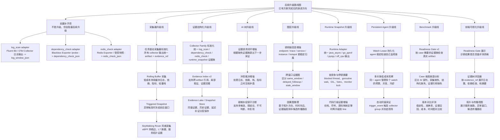
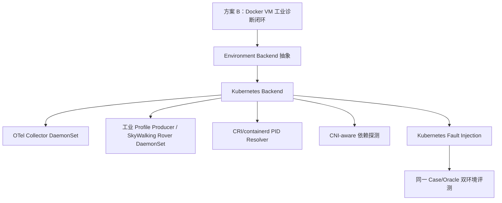

# Evidence-to-Attribution Analyzer 后续升级路线图

> 本文是 `docs/evidence_to_attribution_analyzer.md` 的后续升级副本。
> 它只展示“已有方案未来如何升级”，不重复已完成方案，也不把当前缺口补齐误写成升级。

## 1. 定义边界

这里先把两个概念分开：

| 概念 | 含义 | 示例 |
|---|---|---|
| 补齐 | 当前能力还没有，需要先接入工业成熟采集来源，并转换成结构化证据 | `log_scan`、`dependency_check`、`redis_check` |
| 升级 | 某个能力已经有工业适配版本，再往更强、更稳定、更自动化方向演进 | 从 Fluent Bit/OTel 日志适配升级到 rolling log buffer；从 Blackbox 主动探测升级到 SkyWalking Rover 风格网络画像 |

所以：

```text
补齐 log_scan / dependency_check / redis_check
```

不算本文的“后续升级”，它们是进入后续升级前的前置补齐项。

本文真正关注的是：

```text
当基础能力存在以后，每个部件还能往哪里升级？
```

## 2. 竖型树形图

这张图按“部件”拆分，不把不同部件强行连成一个阶段链。每条分支内部才表示该部件自己的升级路径。



## 3. 前置补齐项

这些不是升级，但它们会影响后续升级是否有意义。

### 3.1 `log_scan`

作用：

```text
把工业日志采集器输出变成 AI 树能理解的结构化证据。
```

推荐采集来源：

```text
Fluent Bit Tail + Multiline
或 OpenTelemetry Collector filelogreceiver
```

Mini-Drop 不自研日志 tail、多行合并、offset、文件轮转和容器日志兼容能力，只做适配、窗口裁剪、字段归一和证据结构化。

它要产出：

- 日志窗口摘要。
- 错误日志簇。
- 异常关键字和错误类型。
- trace_id / span_id / endpoint / dependency。
- 稳定 `evidence_ref`。

它解决的问题：

```text
如果没有日志证据，Payment、Redis、OOM、Disk、Network、Runtime 类 case 容易只能靠指标猜。
```

### 3.2 `dependency_check`

作用：

```text
把工业探测器结果转换成下游依赖是否可达、慢、拒绝连接、DNS 失败或 gRPC NOT_SERVING 的结构化证据。
```

推荐采集来源：

```text
Prometheus Blackbox Exporter /probe
```

Mini-Drop 不自研 DNS/TCP/HTTP/HTTPS/gRPC 探测器，只负责编排目标、读取 probe metrics、转换成证据 JSON。

它要覆盖：

- DNS resolve。
- TCP connect。
- HTTP status / latency。
- gRPC health check。
- Payment / Checkout / Redis 等关键依赖地址。

它解决的问题：

```text
没有依赖探测时，AI 树很难区分“本服务慢”和“下游不可达”。
```

### 3.3 `redis_check`

作用：

```text
把 Redis Exporter 指标或受控 Redis 快照转换成可诊断对象。
```

推荐采集来源：

```text
Redis Exporter metrics
必要时受控执行 Redis INFO / SLOWLOG GET / LATENCY LATEST 快照
```

Mini-Drop 不自研 Redis RESP 协议采集器。Redis 专项信息必须来自成熟 exporter 或受控命令快照。

它要采：

- `PING`。
- `INFO`。
- `SLOWLOG GET`。
- `LATENCY LATEST`。
- 可选 `LATENCY DOCTOR`。

它解决的问题：

```text
Redis pause、慢命令、连接数异常、内存压力、错误回复增加，不能只靠 TCP connect 判断。
```

## 4. 采集器升级线

这一条线的核心是从“任务触发采一下”升级到“持续低成本观察，并在异常窗口冻结证据”。

### 4.1 任务驱动采集器标准化

这是采集器升级的起点。所有 collector 都应该输出：

- 标准 artifact type。
- 标准 metadata。
- 标准 evidence window。
- 标准 evidence family。
- 标准 evidence_ref。

这样后续无论是日志、依赖、Redis、栈还是网络画像，都能进入同一套证据结构化层。

### 4.2 Rolling Buffer 采集

升级方向：

```text
从“发现问题后再采”
升级为
“低成本缓存最近 N 秒，发现问题时可以回看前后窗口”
```

适合进入 rolling buffer 的数据：

- metrics summary。
- log error summary。
- endpoint latency summary。
- dependency probe summary。
- lightweight stack summary。

### 4.3 Triggered Snapshot

升级方向：

```text
trigger_event 出现时，冻结同一窗口内的多类证据。
```

它解决的是瞬时异常：

```text
异常发生时已经保存现场，后续 AI 树不需要假装 delayed follow-up 能恢复现场。
```

### 4.4 SkyWalking Rover 风格采集

这是采集器升级线的长期目标。

升级内容：

- eBPF 采集 L4 网络边。
- 采 TCP 连接失败、RTT、重传、连接状态。
- 在可控范围内识别 HTTP / gRPC / Redis 协议摘要。
- 将网络边归属到 service / instance / process。

它解决的问题：

```text
主动 dependency_check 只能告诉你探测时是否可达。
Rover 风格网络画像能告诉你异常窗口内真实流量发生了什么。
```

## 5. 证据结构化升级线

这一条线的核心是让更多采集器输出进入统一证据世界，而不是各写各的 JSON。

### 5.1 Collector Family 标准化

需要统一的证据族：

| family | 包含 |
|---|---|
| `log_scan` | `log_window_json`、错误簇、日志 trace 关联 |
| `dependency_check` | DNS / TCP / HTTP / gRPC 探测 |
| `redis_check` | Redis INFO / SLOWLOG / LATENCY |
| `runtime_snapshot` | Java / Go / Python / off-CPU runtime 证据 |
| `network_profile` | eBPF 网络边和协议摘要 |

### 5.2 Evidence Index v2

升级目标：

```text
不仅能引用一整个 artifact，还能引用 artifact 内的具体证据单元。
```

例如：

- `log_scan.error_clusters[0]`
- `dependency_check.checks[2]`
- `redis_check.slowlog_summary.top_commands[0]`
- `runtime_snapshot.lock_signals[1]`

### 5.3 Evidence Lake / Snapshot Store

升级目标：

```text
把 same_window、rolling_snapshot、delayed_followup、stale_window 分层保存。
```

这样 AI 树在裁决时不会把不同时间窗口的证据互相错误反证。

## 6. AI 树升级线

这一条线的核心不是让 AI 更自由，而是让 AI 树在证据更复杂时仍然稳定。

### 6.1 证据请求闭环增强

当前 AI 树已经能输出补证请求。后续要增强的是：

```text
根据 case 类型、现有证据族、缺失证据族，选择最小必要采集器。
```

例如：

```text
出现 downstream_dependency 候选
  -> 缺 log_scan
  -> 缺 dependency_check
  -> 先请求 dependency_check，再请求 log_scan
```

### 6.2 冲突裁决增强

新增日志、依赖、Redis、网络画像后，证据之间可能冲突：

```text
日志显示 Redis timeout
dependency_check 显示 Redis 当前可达
same_window metrics 显示网络抖动
delayed_followup 显示恢复正常
```

AI 树要能判断：

- 哪些是 same_window。
- 哪些是 delayed_followup。
- 哪些只能降低置信度。
- 哪些不能直接反证异常窗口。

### 6.3 疑难杂症保守诊断

升级目标：

```text
面对复合故障、多个弱信号、证据冲突时，不强行输出单一根因。
```

允许输出：

- 多候选。
- 主次根因。
- 并列故障域。
- 当前不可判断。
- 待复现。
- 缺证据清单。

## 7. 图层升级线

这一条线的核心是从“热点属于哪条链路”升级到“异常如何沿链路传播”。

### 7.1 调用链回连增强

升级目标：

```text
让函数热点、日志错误、依赖探测结果稳定回到同一个 endpoint / trace / service / instance。
```

这一步仍然不是最终归因，只是归属。

### 7.2 跨窗口证据图

升级目标：

```text
把 same_window、delayed_followup、stale_window 放进图结构。
```

它解决：

```text
后续补采没复现，不能直接推翻异常窗口已经冻结的证据。
```

### 7.3 因果图推理

升级目标：

```text
在复杂微服务拓扑里，基于时间先后、拓扑方向、证据强度排序候选传播路径。
```

注意：这不是规则匹配根因，而是候选排序与证据解释。最终结论仍受 AI 树边界控制。

## 8. Runtime Snapshot 升级线

这一条线专门解决 Java / Go / Python / off-CPU 证据口径不一致。

### 8.1 Runtime Adapter

目标输出：

```json
{
  "collector_family": "runtime_snapshot",
  "runtime": "java|go|python|native|unknown",
  "top_wait_reasons": [],
  "blocked_threads": [],
  "hot_stacks": [],
  "lock_signals": [],
  "call_path_refs": []
}
```

### 8.2 锁竞争与停顿摘要

统一提取：

- Java blocked thread / monitor lock。
- Go goroutine wait / mutex / block profile。
- Python GIL / thread wait / lock。
- Native futex / sched_switch / off-CPU wait。

### 8.3 代码行级证据增强

只有在证据足够时才升级到代码行：

```text
有符号信息
有源码映射
有稳定栈样本
有调用路径上下文
有足够样本数
```

否则仍停在 function 或 call_path。

## 9. Persistent Agent 升级线

这一条线解决“任务下发时异常已经消失”的问题。

### 9.1 Watch Lease 持久化

升级目标：

```text
agent 重启后仍能知道自己负责哪些 watch。
```

当前内存态 watch registry 后续要升级成持久化表。

### 9.2 多对象低成本观察

升级目标：

```text
同一个 agent 可以监视多个 service / pid / endpoint，同时控制预算、并发和冷却时间。
```

### 9.3 自动同窗采证

升级目标：

```text
trigger_event 出现后，自动冻结 snapshot，并按策略启动 logs / dependency / stack / metrics collector group。
```

Persistent Agent 仍然不输出根因，只输出时间锚点和证据窗口。

## 10. Benchmark 升级线

这一条线让测试结果更容易解释。

### 10.1 Readiness Gate v2

升级方向：

```text
从检查通用字段
升级为
按 case 所需证据族检查真实 artifact。
```

例如：

| case 需要 | gate 应检查 |
|---|---|
| `log_scan` | 是否有 `log_window_json` 或 log_scan family |
| `dependency_check` | 是否有 `dependency_check_json` |
| `redis_check` | 是否有 `redis_check_json` |
| `runtime_snapshot` | 是否有 runtime_snapshot family |

### 10.2 Case 维度差距分析

升级目标：

```text
把未命中原因拆开。
```

失败类型：

- AI 判断错。
- 采集器没采到。
- artifact 没结构化。
- evidence_ref 缺失。
- 同窗证据不足。
- oracle 所需证据族缺失。

### 10.3 版本对比评测

升级目标：

```text
比较不同版本在准确率、稳定性、证据召回、成本、耗时上的变化。
```

这能避免只看一个平均分。

## 11. 前端可视化升级线

这一条线不决定后端能力是否成立，但决定用户能不能看懂。

### 11.1 Readiness Gate 展示

展示：

- 当前诊断是否可评测。
- 哪些门禁项失败。
- 缺哪类证据。
- 是否应该先补采。

### 11.2 证据树浏览器

展示：

- evidence_ref。
- artifact。
- 日志簇。
- 依赖检查。
- Redis 摘要。
- runtime snapshot。

### 11.3 拓扑与传播视图

展示：

- 服务调用链。
- 异常窗口。
- 证据时间关系。
- 候选传播路径。
- 多根因 / 复合故障结构。

## 12. 推荐推进方式

先完成前置补齐：

```text
log_scan adapter -> log_window_json
dependency_check adapter -> dependency_check_json
redis_check adapter -> redis_check_json
```

然后按部件独立升级，不强行串成一个总阶段：

| 优先级 | 升级线 | 原因 |
|---|---|---|
| 1 | 证据结构化升级线 | 工业采集器适配产物必须被 AI 树和 gate 识别 |
| 2 | Benchmark 升级线 | 需要判断新证据是否真的改善测试 |
| 3 | Runtime Snapshot 升级线 | 改善 Java / Go / Python lock 和 stall case |
| 4 | Persistent Agent 升级线 | 改善瞬时异常捕捉 |
| 5 | 采集器升级到 Rover 风格 | 改善复杂网络传播和下游问题 |
| 6 | 图层升级线 | 在证据更完整后再做复杂推理 |
| 7 | 前端可视化升级线 | 让用户看懂证据链和评测差距 |

核心原则：

```text
先补证据，再升级推理。
先证明采集真实，再优化 AI 判断。
先接工业采集器，再考虑是否自研补充。
先按部件升级，不把不同部件硬串成一条阶段链。

## 13. Trace Endpoint 复合采集升级

`trace_endpoint_profile` 不再视为 `perf_cpu` 的别名，而是一个复合证据族：

```text
perf/eBPF 栈采样
  + OTel/SkyWalking Trace/Span 关联
  + endpoint/call_path 结构化回连
```

### 13.1 采集边界

栈采样只负责回答“哪个函数或调用栈处于热点”；Trace 适配只负责读取已有的 OTel/SkyWalking 输出；回连层负责在同一目标和时间窗口内生成 endpoint、service、instance、trace 和 call_path 关系。任何一层缺失，都必须保留实际已获得的低层证据，并明确 `max_supported_level`，不能用函数热点推测 endpoint 或完整调用链。

### 13.2 来源优先级

```text
stack_source=auto:
  eBPF profile 可用 -> eBPF
  否则 perf 可用 -> perf
  都不可用 -> structured unavailable artifact

trace_source:
  OTel NDJSON
  或 SkyWalking JSON/NDJSON
  缺失 -> trace_source_missing，不伪造链路
```

支持任务级 `target_config`：

```json
{
  "stack_source": "auto",
  "trace_source": "otel_ndjson",
  "trace_paths": ["/var/lib/mini-drop/traces/otel.ndjson"],
  "service_id": "cartservice",
  "instance_id": "cartservice-worker2",
  "endpoint": "GET /cart"
}
```

### 13.3 关联等级

| 关联等级 | 依据 | 允许的定位 |
|---|---|---|
| explicit | trace/span 显式带 PID、context 或 trace 绑定 | endpoint / call_path |
| pid_instance_time_overlap | PID 或实例与 span 时间窗口重叠 | endpoint，满足条件时 call_path |
| service_time_overlap | service、instance、时间窗口重叠 | 候选 endpoint，不自动升级完整 call_path |
| unmatched | 栈和 Trace 无法对齐 | function |

每条关系必须输出 `correlation_method`、`confidence` 和稳定 `evidence_ref`。

### 13.4 统一产物

主产物为 `trace_endpoint_profile_json`，至少包含：

- `stack_source`：来源、状态、权限和原始产物引用；
- `trace_source`：OTel/SkyWalking 类型、读取数量、窗口内数量和阻断原因；
- `endpoint_bindings`：endpoint、service、instance、trace/span 和关联方法；
- `call_path_hotspots`：函数热点、调用路径、endpoint 和关联置信度；
- `correlation_status`：`completed`、`partial`、`unmatched` 或 `blocked`；
- `max_supported_level`：当前证据允许的最高定位层级。

只有结构化关联成功时，AI 树才允许从 `function` 升级到 `endpoint` 或 `call_path`。

## 14. 采集失败语义补齐

### 14.1 `log_scan`

`log_scan` 的参数来源统一为：

```text
target_config.log_paths/source_paths
  -> invocation options
  -> Agent collector
  -> managed pipeline default
  -> container Docker JSON log fallback
```

日志源存在但窗口内没有记录、没有错误簇，仍然是成功的结构化证据：

```json
{
  "source_status": "empty_window",
  "summary": {
    "window_records": 0,
    "matched_records": 0,
    "error_cluster_count": 0
  }
}
```

只有输入损坏或所有配置源不可读取且没有可用 fallback 时，才标记为不可用或失败。

### 14.2 Trace 权限阻断

当 `perf_event_paranoid`、`perf_event_open`、eBPF capability 或工具缺失阻止采样时，必须输出结构化 `trace_endpoint_profile_json`，包含：

- `blocked_reason`；
- 当前 `perf_event_paranoid`；
- 缺失的 capability/tool；
- 可执行修复动作；
- `max_supported_level=function`。

这类结果不能伪装成完整 Trace 采集成功，但也不能丢失已经采集到的 Trace 或低层上下文。

### 14.3 Worker 能力

Worker Agent 的部署需要显式验证：

```text
privileged
pid: host
PERFMON
SYS_PTRACE
SYS_ADMIN
BPF
seccomp: unconfined
kernel.perf_event_paranoid
```

能力状态进入 `CollectorProfile`，诊断任务据此区分“未安装”“权限阻断”和“目标没有 Trace”。

## 15. 分段任务

```text
AT 采集契约与失败语义
  -> AM 栈/Trace 适配与关联
  -> AN 服务端证据、AI 树和前端
  -> AO Worker 部署与真实 case 验证
```

各段可以独立失败和回归，不把不同部件伪装成一个原子阶段。完成标准不是“任务变成 DONE”，而是对应结构化 artifact、证据引用、定位边界和真实测试结果都闭合。

## 16. 方案 B：工业采集链路加固

本轮真实 `OB-SINGLE-REDIS-001` 暴露了四个需要一起收口的问题：

```text
log_scan 空窗口语义
trace/perf/eBPF 权限与能力闭环
off_cpu 工业化多层采集链路
诊断采集预算与 follow-up 预留
```

本轮采用方案 B，而不是只修错误提示：

1. `log_scan` 在可读空窗口和无错误窗口仍生成 `log_window_json`。
2. Trace/栈采样失败时输出能力状态、阻断原因和可执行修复动作。
3. `off_cpu_wait_profile` 升级为事件层、原因层、栈层、回连层四层链路，不使用 `perf record` 冒充 Off-CPU。
4. 默认总采集时长上限调整为 `180s`，并为 AI 树 follow-up 保留独立额度。

详细设计见：

`docs/superpowers/specs/2026-08-13-industrial-collector-hardening-design.md`

本轮完成标准：

```text
真实空窗口可解释
权限阻断可修复
Off-CPU 结果可区分 empty/partial/blocked/target_exit
事件、等待原因、栈和调用链状态可结构化引用
180s 预算不会吞掉 follow-up 额度
```

## 17. Kubernetes 后续迁移分支

Kubernetes 不是当前方案 B 的验收项，而是方案 B 完成后的环境升级分支。



迁移原则：

- 先抽象环境控制面，再替换运行环境；
- 保留现有 evidence family 和 artifact 契约；
- OTel/Rover/CRI/CNI 是 Kubernetes backend 的实现细节，不改变 AI 树输入；
- Docker VM 与 Kubernetes 必须能跑同一 case/oracle；
- Kubernetes 迁移完成前，不能把 Rover 或 DaemonSet 能力写成当前已完成项。

## 18. 当前方案 B 待验收项

- [x] WatchRuntime gRPC 协议与服务端同步入口。
- [x] Agent 独立 Watch sync loop，可领取多个 watch lease。
- [x] Watch sync 与普通任务心跳分离。
- [x] 同一持续异常窗口重复触发去重。
- [x] 三台 VM 复制粘贴同步最新修改。
- [x] Control/Worker 服务重建并确认 CollectorProfile。
- [x] `OB-SINGLE-REDIS-001` 真实 case 重新运行，使用 `180s` 总预算和 follow-up 保留额度。
- [x] 真实报告检查 `log_window_json`、`dependency_check_json`、`redis_check_json`、`trace_endpoint_profile_json`、`off_cpu_wait_json`。
- [x] Persistent Watch 页面创建 watch、Agent 领取 lease、异常触发 incident、冻结 snapshot、生成 collector tasks，并自动触发 AI 树分析。
- [x] Watch 自动分析具有有界终态：`analyzed`、`needs_evidence` 或 `analysis_failed`，不会永久停留在 `analyzing`。
- [x] Watch 分析失败保留 `auto_analysis_error`、`retryable`、耗时和冻结证据引用，前端可见并允许人工重试。
- [x] 方案 B 部署同步包含 Persistent Watch 前端页面和 Control 分析超时配置。
- [x] Watch delayed follow-up 多任务回灌不会互相覆盖，真实 case 已保留 3 条 delayed follow-up 证据。
- [x] Persistent Watch 已完成 Agent 自动观察真实验证：Agent 自己采样 baseline/trigger window，触发 `cpu_shift` incident，不依赖手工 `/evaluate` 注入窗口。
- [x] 同一持续异常窗口的重复触发已加固：同类 trigger 持续存在时不再反复创建 incident，指标恢复后才允许下一次同类 trigger。
- [x] Watch 测试脚本支持 `agent_observe`、受控延迟异常 fixture、分析后清理 fixture，以及测试 watch 自动 disabled，避免测试遗留 watch 造成任务风暴。

当前真实验收结论：

```text
方案 B 主链路已闭合：
工业采集器 -> 结构化 artifact -> readiness gate -> AI 树补证 -> 报告/Watch 回灌
```

仍需单独标记的深度能力限制：

- `dependency_check`、`redis_check`、`log_scan`、`off_cpu_wait_json`、`trace_endpoint_profile_json` 均已生成结构化产物。
- Off-CPU 已在真实 Linux Worker 捕获等待事件，但 `kernel.perf_event_paranoid=4` 导致用户态和内核态栈均未符号化。
- `perf_cpu` 在当前 Worker 宿主机上仍会被 `perf_event_paranoid` 阻断，因此不能把当前报告宣称为函数级 CPU hotspot 已验证。
- Trace 当前因 Worker 没有可读取的 OTel/SkyWalking Trace 输出而停在 `max_supported_level=function`；这是真实证据边界，不是 AI 猜测。
- OTel Trace 目录存在但窗口内没有 Trace 文件/记录时，结构化结果标记为 `empty_window`；只有路径不可用时才标记为 `trace_source_missing`。
- 需要在两台 Worker 宿主机明确允许 `kernel.perf_event_paranoid=1` 后，才能进行最后一次非阻断的深度栈验收。
- 最新 Watch 真实 case 已进入 `needs_evidence` 有界终态，原因是 CPU perf 被宿主机权限阻断且 Trace 源为空；这表示 AI 树没有强行编造 endpoint/call_path 或代码行级结论。
- 最新 Agent 自动观察 case 证明持续监测链路能由 Agent 自己触发 incident；该 case 的 AI 树仍停在 `needs_evidence`，原因是 Trace 源为空且 `perf_cpu` 被 `perf_event_paranoid=4` 阻断，但 same-window `sys_metrics`、`baseline_window_profile`、`off_cpu_wait_profile`、`trace_endpoint_profile` 和 delayed follow-up 已回灌。
- Watch 自动 AI 分析默认最多等待 `150s`，单次 LLM 请求默认 `45s`；超时会进入 `analysis_failed`，不会伪装成 `not_started` 或继续占用前端等待。

本轮报告：

- Redis：`reports/eval/ai-ops-v2/scheme-b-redis-20260814-112808/`
- Watch：`reports/eval/ai-ops-v2/watch-scheme-b-20260814-113744.json`
- Watch Agent 自动观察：`reports/eval/ai-ops-v2/watch-agent-observe-20260814-121400.json`

Kubernetes 迁移仍属于第 17 节的后续升级分支，不计入本轮方案 B 完成条件。

## 19. 方案 B 与 Kubernetes 的边界

本轮“完成方案 B”指 Docker VM 环境中的现有证据链闭环，不要求当前测试环境迁移到 Kubernetes：

```text
Docker VM
  -> 工业采集器
  -> 结构化 artifact
  -> Evidence-to-Attribution / AI 树
  -> Watch 冻结与 delayed follow-up
  -> 报告、前端和审计包
```

Kubernetes 只作为后续环境升级，迁移时复用上述输入输出契约：

```text
Environment Backend Contract
  -> Kubernetes Backend
  -> OTel Collector DaemonSet
  -> SkyWalking Rover / industrial profile producer
  -> CRI/containerd PID resolver
  -> CNI-aware dependency probing
  -> 同一 Case/Oracle 双环境评测
```

因此，当前不能把 Kubernetes 的 DaemonSet、Rover、CRI/containerd 或 CNI 能力计入方案 B 已完成能力；只有 Docker VM 与 Kubernetes 能跑同一 case、产生同一 evidence family、通过同一 readiness/oracle 门禁时，才允许宣布迁移完成。
