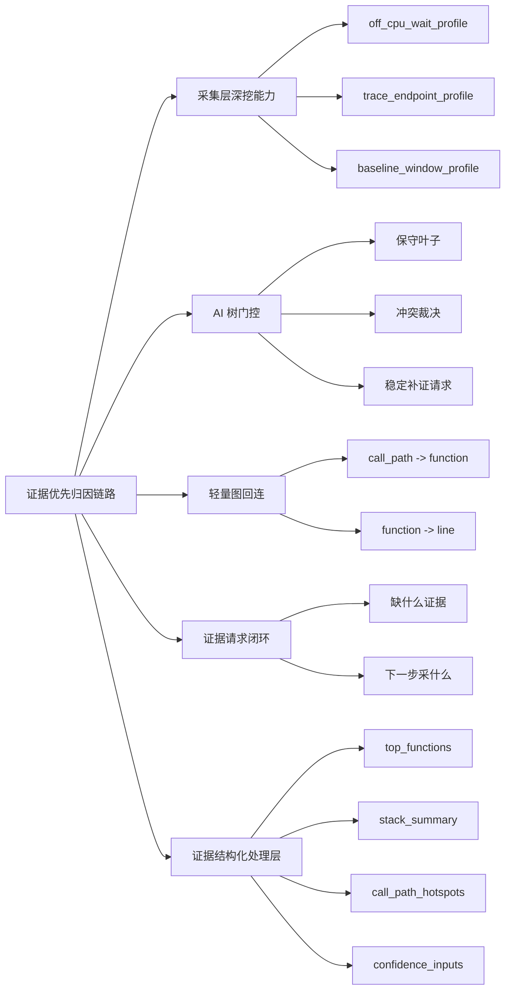
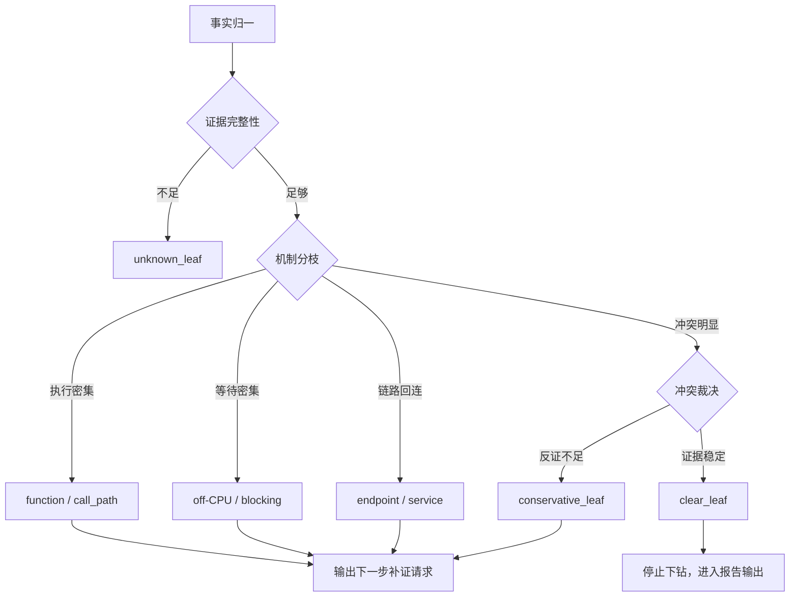
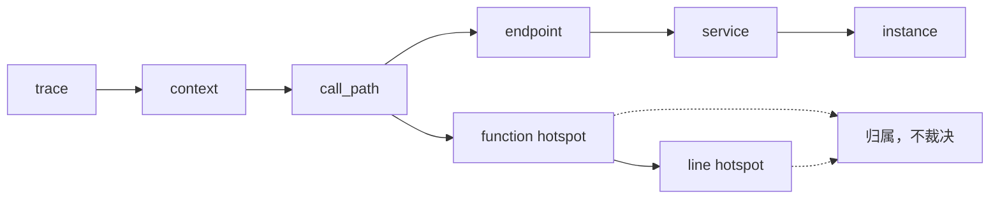

# 本周成果汇报：AI 智能归因与定位链路

汇报日期：2026-08-06

## 1. 本周目标

本周围绕 Mini-Drop 的 AI 智能归因能力，重点推进 `Evidence-to-Attribution Analyzer` 方案落地。

核心目标不是让 AI 更大胆地猜测根因，而是让系统在证据边界内稳定归因：

- 从“先生成假设，再找证据”调整为“先看证据能证明到哪，再决定归因边界”。
- 降低多次重复分析时的结论抖动。
- 在证据不足时允许停留在 `resource / function / call_path / line` 等不同层级，而不是强行输出 root cause。
- 补齐采集层缺口识别、AI 树门控、轻量图回连和证据请求闭环。

## 2. 本周成果总览图



## 3. 总体完成情况

本周已完成从方案设计、任务拆分、代码实现、真实数据测试到方案文档收敛的完整闭环。

当前 `specs/001-evidence-attribution-analyzer/tasks.md` 中主任务和扩展任务均已完成：

- 基础 Evidence-to-Attribution 主链路：`T001-T014` 已完成。
- 采集层深挖工具补齐：`A001-A006` 已完成。
- AI 定位层缺证识别：`B001-B005` 已完成。
- 重复任务稳定性优化：`C001-C005` 已完成。
- 原始证据先存后取：`D001-D003` 已完成。
- AI 树门控与保守叶子：`E001-E004` 已完成。
- 轻量图回连层：`F001-F004` 已完成。
- 方案 3 升级预留：`G001-G003` 已完成。
- AI 树冲突裁决分枝：`H001-H004` 已完成。
- 图层热点归属边：`I001-I004` 已完成。
- 证据请求闭环：`J001-J004` 已完成。
- 证据结构化处理层：`K001-K003` 已完成。
- Artifact 入口接入：`L001-L003` 已完成。
- RCA 消费与验证：`M001-M004` 已完成。

## 4. 核心成果

### 4.1 Evidence-to-Attribution 主链路落地

已将 RCA 分析从候选原因优先，调整为证据优先。

当前 Analyzer 会先生成结构化分析结果，再约束候选原因和 LLM 报告输出：


主要收益：

- 归因结论必须有事实和现象支撑。
- 不允许 LLM 引用不存在的证据。
- 不允许在 `conclusion_boundary.can_claim_root_cause=false` 时输出确定性根因。
- 能明确说明当前最多只能定位到哪一层。

### 4.2 采集层深挖能力补齐

已在采集能力注册表中补齐深挖探针：

- `off_cpu_wait_profile`：用于区分执行密集、锁等待、IO 阻塞、调度等待等机制。
- `trace_endpoint_profile`：用于将函数热点回连到 endpoint、service、instance 和调用链上下文。
- `baseline_window_profile`：用于多窗口对齐，降低重复任务下结论波动。

这些能力不是默认全量开启，而是作为 Analyzer 发现证据缺口后的下一步补证方向。

### 4.3 缺证识别与边界输出

结构化分析结果已增加以下字段：

- `missing_evidence`
- `blocked_upgrades`
- `collection_gaps`
- `conclusion_boundary`

现在当系统只能定位到函数层时，会明确说明：

- 缺少 `off_cpu_wait_profile`，无法判断热点是执行密集还是等待密集。
- 缺少 `trace_endpoint_profile`，无法把函数热点稳定回连到调用路径。
- 缺少 `baseline_window_profile` 时，低稳定性结论需要多窗口验证。

### 4.4 稳定性优化

本周重点解决了“同一数据多次分析，结论不应明显漂移”的问题。

已完成的稳定性策略包括：

- 主因选择不依赖候选输入顺序。
- 按固定裁决顺序选择主因：定位层级更深、支持事实更多、反证更少、最后按稳定 `candidate_id` 兜底。
- 对重复或语义等价证据去重，避免同一信号重复抬高置信度。
- 对证据不足和临界场景使用 `conservative_leaf` 或 `unknown_leaf`，避免强行升级。

### 4.5 AI 树门控与冲突裁决

已实现 AI 树结构化输出，包含：

- `branch_key`
- `decision`
- `leaf_status`
- `conflict_type`
- `evidence_family`
- `conflict_candidates`
- `next_evidence_requests`
- `evidence_refs`
- `reason`

AI 树当前承担三类职责：

- 判断证据是否足够继续下钻。
- 在多个候选方向冲突时进行保守裁决。
- 输出下一步最需要补齐的证据类型。

冲突场景下，系统会保留稳定主因，同时把其他部分成立的方向降级为保守叶子，避免把多个相关现象都说成确定根因。

AI 树处理流程如下：



### 4.6 轻量图回连层

已补齐轻量图结构：

- `graph_entities`
- `graph_links`
- `graph_extension_points`

当前图层只负责回答“热点属于哪条链路”，不直接判断最终根因。

已支持的实体包括：

- `trace`
- `context`
- `call_path`
- `endpoint`
- `service`
- `instance`
- `function`
- `line`

已补齐的热点归属边包括：

- `call_path -> function`：`owns_hotspot`
- `function -> line`：`refines_hotspot`

这使得同一个函数热点可以稳定回连到同一个请求路径和上下文，同时不会把图关系越权解释成 root cause。

轻量图回连结构如下：



### 4.7 证据请求闭环

已实现 `next_evidence_requests`，让树叶子不只是输出“证据不足”，而是明确下一步要补什么。

当前稳定请求顺序包括：

- 函数热点已见但机制不清：优先请求 `off_cpu_wait_profile`。
- 函数热点已见但链路未回连：优先请求 `trace_endpoint_profile`。
- 结论稳定性偏低：请求 `baseline_window_profile`。

同一证据缺口下，请求列表保持一致，不受候选输入顺序影响。

### 4.8 证据结构化处理层

本周补齐了采集器产物和 Evidence-to-Attribution 之间缺失的一层：


这一层不做 AI 推理，也不判断 root cause，只负责把采集结果转换为 RCA 能稳定消费的证据对象。

当前已经支持：

- `top_json -> top_functions`
- `depth_evidence_json -> stack_summary / call_path_hotspots / evidence_index`
- `flamegraph_json -> compact top_functions`
- `flamegraph_svg -> 受限 title 热点解析`
- `sys_metrics / ebpf_metrics -> confidence_inputs`
- `raw / perf.data / svg -> artifact_refs`

这解决了一个关键问题：`pyspy.svg`、`perf.data`、火焰图这类产物不再直接进入 LLM 上下文，而是先变成可检索、可引用、可压缩、可反问的结构化证据。

当前结构化输出包括：

- `artifact_refs`
- `top_functions`
- `stack_summary`
- `call_path_hotspots`
- `evidence_index`
- `confidence_inputs`

同时，最终 RCA 报告已经可以携带 `structured_evidence`，不仅接口顶层能看到，保存的 `report_json` 里也能保留这份结构化摘要。

## 5. 文档与方案沉淀

已更新并收敛方案文档：

- `docs/evidence_to_attribution_analyzer.md`
- `specs/001-evidence-attribution-analyzer/tasks.md`

方案文档当前已覆盖：

- Evidence-to-Attribution 主链路。
- 采集层与 AI 定位层增强。
- AI 树 + 轻量图处理层。
- 冲突裁决分枝。
- 热点归属边。
- 证据请求闭环。
- 证据结构化处理层。
- 方案 3 后续升级口。

## 6. 测试与验证

本周已完成聚焦测试和回归验证。

已验证内容包括：

- CPU hotspot 必须同时依赖 CPU 高和函数热点事实。
- IO wait 必须依赖 iowait 和 IO latency 证据。
- 非热点函数不会被升级为 CPU root cause。
- 只有 CPU 资源信号但缺少热点时，结论保持 fragile，不进入允许根因集合。
- 函数层结果能报告缺少 `off_cpu_wait_profile` 和 `trace_endpoint_profile`。
- 栈、调用路径和行号证据充足时，可以升级到 `line` 层。
- 缺少行号候选时，系统保守停在 `call_path` 或 `function`。
- AI 树和图层输出在重复运行中保持一致。
- 图层回连不会越权变成根因判断。
- 冲突候选在重复运行中稳定进入同一冲突分枝。
- 补证请求列表在相同证据缺口下保持一致。
- SVG-only 产物不会把原始 SVG 送入 LLM，但会保留 artifact 引用。
- 有 `depth_evidence_json` 时能生成 `stack_summary`、`call_path_hotspots` 和 `confidence_inputs`。
- `structured_evidence` 已挂入最终 RCA 报告对象和 evidence snapshot。

最近一次全量回归结果：

```text
$env:MINI_DROP_API_AUTH_ENABLED='0'; python -m pytest -q
386 passed
```

## 7. 当前效果

系统现在已经具备更完整的“证据到归因”能力：

- 能从结构化采集数据生成事实、现象、定位、归因和证据反问。
- 能明确区分主因、次因、伴随现象和不支持结论。
- 能在证据不足时保守停留，不强行升级。
- 能识别采集层缺少什么工具能力。
- 能把原始/半原始采集产物先结构化，再交给归因链路。
- 能把热点回连到调用链上下文。
- 能输出下一步补证请求。
- 能让同一输入在重复运行中保持较稳定的结论。

## 8. 风险与限制

当前仍然存在以下边界：

- 图层目前只做轻量归属，不做跨窗口传播推理。
- 行级定位依赖 `line_candidates` 和足够上下文证据，缺失时不会强行升级。
- `off_cpu_wait_profile`、`trace_endpoint_profile` 等深采集能力已进入探针注册和缺口识别，但真实采集质量仍需要更多数据验证。
- SVG title 解析是辅助 fallback，不是主路径；主路径仍应优先产出 `top_json` 或 `depth_evidence_json`。
- 当前方案不依赖训练集和历史案例，因此疑难场景下会更保守。

## 9. 下周计划

建议下周围绕真实数据验证和方案 3 预研继续推进：

1. 使用 `database/20260730` 数据集跑完整链路，保存完整结构化结果和报告。
2. 对真实结果中的 `missing_evidence`、`blocked_upgrades`、`next_evidence_requests` 做专项复核。
3. 检查热点归属边是否能稳定回连到同一条调用链。
4. 梳理方案 3 的图推理升级边界，只增强链路传播分析，不破坏当前证据边界。
5. 补充更多疑难场景样例，验证保守叶子和冲突裁决是否仍然稳定。
