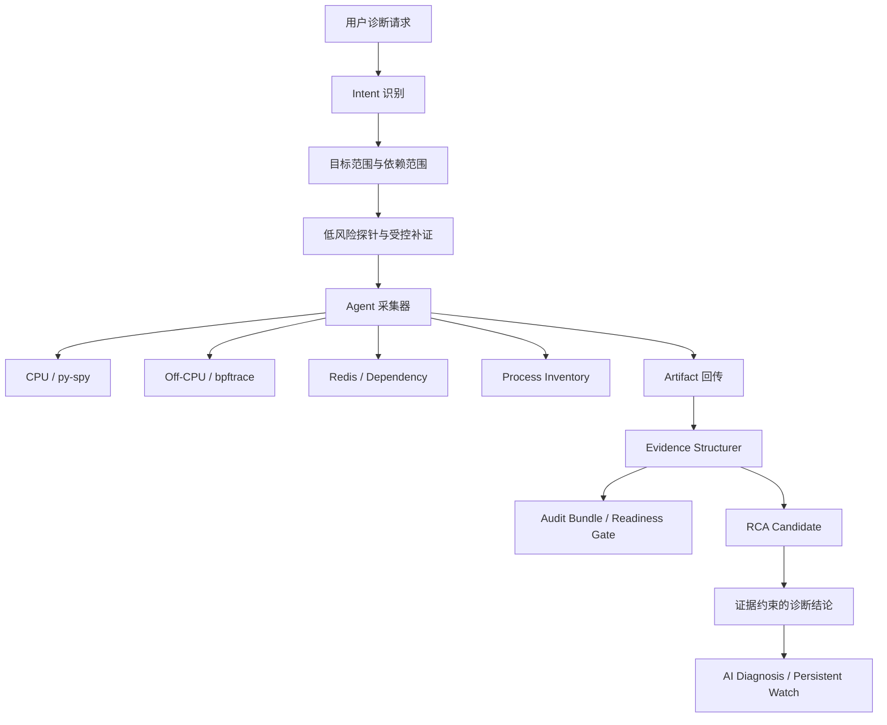

# 本周进展总结：AI 诊断、持续观测与 AI Ops v2 评测

汇报日期：2026-08-13

统计范围：2026-08-10 至 2026-08-13

统计基线：当前分支 `try1`，包含已提交历史和当前工作区未提交变更。

## 1. 仓库状态概览

| 项目 | 当前状态 |
|---|---|
| 当前分支 | `try1` |
| 远端分支 | `origin/try1` |
| 与远端同步情况 | 已同步，领先 `0` 个提交，落后 `0` 个提交 |
| 本周提交数 | 4 个 |
| 已修改但未提交 | 37 个文件 |
| 未跟踪内容 | 4 项 |
| 最新提交 | `6f1c202`，2026-08-12 21:19:47 |
| 跟踪文件未提交差异 | 2574 行新增，204 行删除 |
| 本次总结是否修改业务代码 | 否 |

当前工作区仍处于开发状态。已提交代码已经推送并与远端同步，但本周后续的采集器增强、诊断编排调整、评测环境修正和评测产物尚未提交。

未跟踪内容如下：

- `agent/mini_drop_agent/collectors/process_inventory.py`
- `tests/test_process_inventory_collector.py`
- `docs/ai_ops_v2_test/AI_OPS_V2_FULL_TEST_RUNBOOK_CN.md`
- `reports/`

## 2. 本周工作主线

本周围绕 `Evidence-to-Attribution Analyzer` 继续推进，整体方向从单次 AI 诊断基线扩展到：


主要工作可以归纳为五条线：

1. 完善 AI 诊断和 RCA 的证据优先处理链路。
2. 增加 Persistent Watch 持续观测和事件级分析能力。
3. 补齐 off-CPU、Python runtime、Redis、依赖和进程清单等采集能力。
4. 建立并运行 AI Ops v2 多场景、多节点评测体系。
5. 根据真实 VM 运行结果修正环境、采集和评测脚本。

## 3. 已提交工作

### 3.1 `0101982`：建立单租户 AI Diagnosis Beta 基线

提交时间：2026-08-10 20:51:06

提交主题：`feat: establish single-tenant AI diagnosis beta baseline`

变更规模：79 个文件，新增 7979 行，删除 34 行。

本次提交完成了 AI 诊断 Beta 的基础工程闭环：

- 建立单租户 AI 诊断会话和服务端 API 基线。
- 增加诊断上下文、当前理解、提案卡片和恢复计划等服务端模型。
- 增加目标会话、证据字段和相关数据库迁移。
- 建立探针注册、任务执行、证据记录和报告输出的基础链路。
- 增加测试集定义、测试集校验和评分脚本。
- 增加 Online Boutique 真实场景测试集和故障注入脚本。
- 增加 AI Diagnosis 工作区前端页面和对话式诊断界面。
- 增加 Beta 交付指南、发布基线 Runbook 和 AI 设计文档。
- 扩展 CI、Makefile 和原生 Agent 发布打包流程。

该提交的作用是把 AI 诊断从设计和局部能力推进到可以运行、测试和交付的 Beta 基线。

### 3.2 `c143eb1`：增加 Persistent Watch 事件分析

提交时间：2026-08-12 01:17:35

提交主题：`feat: add persistent watch incident analysis`

变更规模：24 个文件，新增 4026 行，删除 51 行。

本次提交重点完成持续观测到事件诊断的链路：

- 新增 `persistent_trigger.py`，支持基于持续观测数据触发诊断事件。
- 新增 `rolling_buffer.py`，保存事件前后滚动窗口数据。
- 新增 `watch_runtime.py`，管理 Watch 运行时、租约和采集窗口。
- 扩展诊断编排器，使其能够消费持续观测事件。
- 扩展 Evidence Structurer，将持续窗口产物转换为结构化证据。
- 扩展 RCA Attribution 和报告 Prompt，支持时间归因。
- 新增 Persistent Watch API、路由和前端页面。
- 增加持续触发器、滚动缓冲、时间归因、Watch Runtime 和服务 API 测试。

这一阶段解决了“只分析一次快照”的限制，使系统能够围绕持续发生的性能问题进行窗口化分析和事件级定位。

### 3.3 `51bca71`：增加 AI Ops v2 评测数据集

提交时间：2026-08-12 21:18:22

提交主题：`test: add ai ops v2 evaluation dataset`

变更规模：121 个文件，新增约 174379 行。

本次提交建立了较完整的 AI Ops v2 评测资产：

- 增加公开测试用例和私有 Oracle。
- 增加单故障、复合故障、负向样本和鲁棒性样本。
- 覆盖 CPU、磁盘、网络、内存、OOM、Redis、Payment、锁竞争和运行时停顿等场景。
- 增加多节点 VM 环境描述和 Online Boutique VM 编排文件。
- 增加 VM 故障注入脚本和 Java、Go、Python、网络、磁盘故障辅助程序。
- 增加故障清理、评测运行、Readiness Gate、评分和结果对比脚本。
- 增加 90 轮评测的历史 Bundle、评测 JSON 和 Markdown 报告。
- 增加中文 Runbook、测试集说明和指标建议文档。

该提交把 AI 诊断验证从单元测试和局部集成测试扩展到了可重复的多节点场景评测。

### 3.4 `6f1c202`：增加托管采集器与目标范围证据

提交时间：2026-08-12 21:19:47

提交主题：`feat: add managed collectors and target-scoped evidence`

变更规模：44 个文件，新增 4258 行，删除 40 行。

本次提交主要加强采集器和证据边界：

- 增加 Agent 采集器 Profile 和托管采集器配置。
- 增加 Dependency、Log Scan 和 Redis Check 采集器。
- 增加 Blackbox Exporter、Fluent Bit、Redis Exporter 的部署配置。
- 增加 `collector_invocation`，记录采集器是如何被调用的。
- 增加 `target_config` 和目标范围信息，避免使用全局目标污染当前诊断。
- 扩展 Audit Bundle，增加运行时轨迹、结构化证据和证据引用。
- 增加 Readiness Gate 和 Benchmark Score 相关逻辑。
- 扩展 Evidence Structurer 和 RCA Attribution。
- 扩展 gRPC 初始化、健康检查和任务结果回传。
- 增加 Agent Detail、Dashboard 和 Persistent Watch 的前端展示。
- 增加采集器映射、证据结构化、RCA 归因和服务 API 测试。

这一阶段把采集器产物和 RCA 结论之间的证据关联做得更明确，为后续审计、评分和目标隔离提供基础。

## 4. 未提交工作

当前未提交改动是本周后续开发和真实评测修正的主要内容。跟踪文件差异为 37 个文件、2574 行新增、204 行删除；此外还有 4 项未跟踪内容。

### 4.1 Agent 采集器增强

涉及文件：

- `agent/mini_drop_agent/collectors/continuous.py`
- `agent/mini_drop_agent/collectors/dependency.py`
- `agent/mini_drop_agent/collectors/off_cpu.py`
- `agent/mini_drop_agent/collectors/pyspy.py`
- `agent/mini_drop_agent/collectors/redis_check.py`
- `agent/mini_drop_agent/main.py`
- `agent/mini_drop_agent/collectors/process_inventory.py`

主要变化：

- `continuous.py`
  - 区分原始窗口数据和结构化窗口数据。
  - 在 `windows.json` 中增加质量信息。
  - 只有 Analyzer 生成非空结构化栈时才标记窗口具备结构化结果。
  - 即使结构化解析失败，也保留原始 perf 数据和失败原因。

- `dependency.py`
  - 根据目标协议决定 Blackbox Probe 使用 URL 还是 host/port 地址。
  - 避免非 HTTP 目标错误地使用 URL 作为探测目标。

- `off_cpu.py`
  - 从原先复用 perf 骨架改为工业化 bpftrace `sched_switch` 等待栈采集。
  - 增加 bpftrace 预检、目标线程发现、脚本生成和超时终止。
  - 输出 `off_cpu_wait.json` 和原始 `bpftrace_offcpu.txt`。
  - 记录等待原因、等待栈、线程等待汇总、系统调用族和等待总时长。
  - 对 bpftrace 不可用、目标 PID 不存在、启动失败和空输出进行结构化标记。

- `pyspy.py`
  - 从 py-spy SVG 标题中提取 Top 函数。
  - 新增 `top.json` 结构化产物。
  - 扩展 native unwind 失败重试条件，覆盖 `UNW_EINVAL` 等错误。

- `redis_check.py`
  - 支持从 `dependency_targets` 中自动识别 Redis 依赖。
  - Redis Exporter 指标不可用时仍生成结构化结果，而不是直接丢失整个证据对象。
  - 明确区分 exporter 不可用和 Redis 本身不健康。

- `process_inventory.py`
  - 新增基于 `/proc` 的进程清单采集器。
  - 输出 PID、命令名、命令行、用户、CPU、RSS、线程数和服务/实例推断信息。
  - 为 Persistent Watch 的目标进程选择提供数据来源。

- `main.py`
  - 注册 `process_inventory` 能力。
  - 增加 `pyspy` 和 `process_inventory` 的任务类型映射。

### 4.2 Server、诊断编排和 RCA 增强

涉及文件：

- `server/app/diagnosis/audit_bundle.py`
- `server/app/diagnosis/evidence_structurer.py`
- `server/app/diagnosis/intent.py`
- `server/app/diagnosis/orchestrator.py`
- `server/app/diagnosis/probe_registry.py`
- `server/app/diagnosis/schemas.py`
- `server/app/diagnosis/store.py`
- `server/app/grpc_services/healthcheck_service.py`
- `server/app/grpc_services/hotmethod_service.py`
- `server/app/main.py`
- `server/app/rca/candidates.py`
- `server/app/rca/models.py`
- `server/app/rca/rules.json`
- `server/app/schemas.py`

主要变化：

- 诊断意图新增 `runtime_contention`，可以识别锁、阻塞、等待、线程过多、stall 等运行时竞争类问题。
- 探针注册增加 Python runtime profile，并将 off-CPU 采集明确为 bpftrace/eBPF 等待栈能力。
- 运行时竞争场景会优先选择：
  - `host_process_metrics`
  - `process_off_cpu_profile`
  - `process_python_runtime_profile`
  - `process_trace_endpoint_profile`
- Evidence Structurer 增加 `off_cpu_wait_json`。
- Off-CPU 等待栈可以回填 `top_functions`、`stack_summary`、`confidence_inputs` 和 `evidence_index`。
- Audit Bundle 增加运行时栈质量门禁，避免空的 runtime 产物被误认为有效证据。
- 增加 `off_cpu_wait_profile` 采集族及其结构化证据映射。
- RCA Candidate 增加以下匹配器：
  - `dependency_failure`
  - `redis_failure`
  - `runtime_top_function_present`
  - `off_cpu_wait_hotspot`
- RCA 规则新增下游依赖不可达、Redis 不健康、Python runtime hotspot 和 Off-CPU wait hotspot 候选。
- 审批接口增加批量批准当前等待探针的能力。
- 诊断创建接口增加 `auto_execute_policy`。
- Diagnosis Store 在创建事件前执行 `flush()`，确保新建诊断 ID 可被事件正确引用。
- Agent 进程清单增加刷新 API 和查询 API。

### 4.3 前端功能调整

涉及文件：

- `web/src/api/client.js`
- `web/src/pages/AIDiagnosis.jsx`
- `web/src/pages/PersistentWatch.jsx`

主要变化：

- AI Diagnosis 页面增加执行策略：
  - 仅自动执行低风险探针。
  - 开发模式自动批准 AI 树补证探针。
  - 全部人工审批。
- 增加“一键批准当前待采集探针”按钮。
- 对已进入终态的诊断禁止继续审批旧探针，并给出提示。
- 展示定位层级、具体锚点、等待原因和证据引用。
- Persistent Watch 页面可以刷新 Agent 进程清单。
- 支持按 PID、进程名、命令行、服务名搜索进程。
- 选择进程后自动填充目标 PID、Service 和 Instance。
- 将服务标识、Endpoint、保留窗口和目标 JSON 收入高级配置区域。

### 4.4 测试补充

涉及文件：

- `tests/test_agent_depth_collectors.py`
- `tests/test_analyzer.py`
- `tests/test_continuous_collector.py`
- `tests/test_diagnosis_orchestrator.py`
- `tests/test_diagnosis_probe_registry.py`
- `tests/test_evidence_structurer.py`
- `tests/test_grpc_services.py`
- `tests/test_pyspy_collector.py`
- `tests/test_rca_enhanced.py`
- `tests/test_server_api.py`
- `tests/test_process_inventory_collector.py`

新增或扩展的验证点包括：

- Off-CPU 采集器在没有 bpftrace 时输出不可用状态，而不是伪装成成功。
- bpftrace 输出可以解析为等待栈、线程等待和等待原因。
- Continuous Profiling 能区分原始产物和结构化栈。
- py-spy native unwind 失败时会自动无 native 重试。
- py-spy SVG 可以生成非空 `top.json`。
- Off-CPU 结构化证据可以进入 Evidence Structurer 和 RCA 输入。
- 新增运行时竞争探针和 RCA 候选可以被正确选择和触发。
- gRPC 可以正确处理 Off-CPU 等待证据和进程清单证据回传。
- 进程清单刷新、查询和目标进程筛选 API 可以正常工作。

### 4.5 AI Ops v2 评测脚本和环境修正

涉及文件：

- `docs/ai_ops_v2_test/benchmarks/ai_ops_v2/vm_faultctl.sh`
- `docs/ai_ops_v2_test/benchmarks/online_boutique_vm/stack.yml`
- `docs/ai_ops_v2_test/scripts/run_ai_ops_v2_vm.py`
- `docs/ai_ops_v2_test/AI_OPS_V2_FULL_TEST_RUNBOOK_CN.md`

主要变化：

- 将 VM 故障注入脚本中的节点地址切换到当前三节点环境：
  - control：`172.18.88.237`
  - worker1：`172.18.90.144`
  - worker2：`172.18.87.120`
- Online Boutique 镜像切换到 Google 官方样例镜像地址。
- 评测脚本增加 Online Boutique Docker Swarm 环境检查。
- 增加 manager、服务列表、服务副本和前端 HTTP 健康检查。
- 远程下发故障辅助程序和采集器相关文件。
- 增加 worker collector override，使 Agent、Blackbox Exporter 和 Redis Exporter 能接入 Online Boutique 网络。
- 诊断运行器切换到当前 `/api/v1/diagnoses` 入口。
- 增加 API 错误类型封装，允许对并发探针预算耗尽进行特定处理。
- 增加诊断复用关闭逻辑，避免评测重复使用旧诊断结果。
- 增加 API Key 多路径读取，但不在输出中打印具体密钥。
- 新增完整中文 VM 评测 Runbook。

## 5. 未提交评测产物

当前 `reports/eval/ai-ops-v2` 目录尚未跟踪，包含 8 月 13 日生成的多轮运行结果：

| 统计项 | 数量 |
|---|---:|
| 文件总数 | 90 |
| 目录总数 | 40 |
| JSON 文件 | 69 |
| JSONL 文件 | 18 |
| ZIP 文件 | 3 |
| 总大小 | 约 1.4 MB |

已生成的运行类型包括：

- Redis 冒烟运行：
  - `smoke-redis`
  - `smoke-redis-20260813-001924`
  - `smoke-redis-20260813-002332`
  - `smoke-redis-20260813-002827`
  - `smoke-redis-20260813-002953`
  - `smoke-redis-20260813-005453`
  - `smoke-redis-20260813-010340`
  - `smoke-redis-20260813-010639`
- CPU 深度运行：
  - `deep-cpu-20260813-121553`
- Python Lock 深度运行：
  - `deep-python-lock-20260813-121448`
  - `deep-python-lock-20260813-122608`
  - `deep-python-lock-fixed-20260813-125837`
  - `deep-python-lock-fixed-20260813-130902`
  - `deep-python-lock-pyspy-retry-20260813-131457`
- Off-CPU 工业采集器运行：
  - `deep-python-lock-offcpu-industrial-20260813-141330`
  - `deep-python-lock-offcpu-industrial2-20260813-142451`
  - `deep-python-lock-offcpu-industrial3-20260813-144614`
  - `deep-python-lock-offcpu-industrial4-20260813-150222`
- 同步用 ZIP 产物：
  - `offcpu-fix-sync.zip`
  - `offcpu-hotmethod-sync.zip`
  - `offcpu-industrial-sync.zip`

最新一次运行摘要：

路径：`reports/eval/ai-ops-v2/deep-python-lock-offcpu-industrial4-20260813-150222/summary.json`

```json
{
  "planned_runs": 1,
  "completed_runs": 1,
  "failed_runs": 0,
  "terminal_status": "BUDGET_EXHAUSTED",
  "mean_elapsed_sec": 52.88,
  "rollback_failures": 0,
  "frontend_status": 200,
  "unhealthy_services": []
}
```

这里的 `summary.json` 是 VM Runner 运行摘要，不是最终评分结果。当前摘要中没有准确率或综合分字段，因此不能据此宣称 AI Ops v2 评分已经完成。

## 6. 当前已形成的能力闭环

当前代码和未提交改动合起来，已经形成以下处理链路：



相较本周开始时，当前系统已经不只是“采集数据并生成报告”，还能够：

- 说明证据来自哪个目标、哪个采集器和哪个时间窗口。
- 识别结构化运行时信号是否为空。
- 使用 Off-CPU 等待栈支持锁、阻塞和 IO 等待分析。
- 通过 Python runtime profile 补充用户态调用栈。
- 通过进程清单帮助用户选择 Persistent Watch 目标。
- 根据证据缺口选择下一步深挖探针。
- 在 Redis 或下游依赖失败时生成专门 RCA 候选。
- 在证据质量不足时保留不可用或空结果状态，而不是伪造成功。

## 7. 验证情况

本次总结操作只读取 Git 状态、提交记录、差异和评测产物，未在本次操作中执行 `pytest` 或重新运行 VM 评测。

从仓库记录和当前未提交测试代码可以确认，已经覆盖以下验证方向：

- Agent 深度采集器行为。
- Off-CPU bpftrace 输出解析。
- py-spy native fallback 和 Top 函数提取。
- Continuous Profiling 结构化质量判断。
- Evidence Structurer 的等待证据归一化。
- Runtime contention 探针选择。
- Dependency、Redis 和 Off-CPU RCA 候选。
- gRPC 证据回传。
- Agent 进程清单查询 API。
- Persistent Watch 进程选择流程。

需要注意，当前未提交变更尚未形成新的提交基线，因此这些测试是否在当前完整工作区全部通过，需要单独执行项目验证命令确认。

## 8. 风险和待确认事项

### 8.1 未提交改动范围较大

当前未提交变更同时涉及 Agent、Server、RCA、前端、测试和评测脚本，不能简单视为单一小修复。重点大文件包括：

- `server/app/diagnosis/orchestrator.py`：新增约 528 行。
- `agent/mini_drop_agent/collectors/off_cpu.py`：新增约 506 行净变化。
- `docs/ai_ops_v2_test/scripts/run_ai_ops_v2_vm.py`：新增约 248 行净变化。
- `tests/test_diagnosis_orchestrator.py`：新增约 186 行净变化。
- `web/src/pages/PersistentWatch.jsx`：新增约 151 行净变化。

建议后续按功能拆分提交，至少区分：

1. Agent 采集器和进程清单。
2. Server/RCA 证据链和诊断编排。
3. 前端审批与进程选择。
4. AI Ops v2 环境及评测脚本。
5. 测试和评测产物。

### 8.2 Off-CPU 工业采集依赖 Linux 能力

`off_cpu.py` 当前要求 Linux `/proc`、目标线程和 `bpftrace`。在 Windows 开发环境可以进行单元测试，但不能代表真实 Linux VM 上一定能成功采样。

需要继续确认：

- Worker 是否安装 bpftrace。
- Agent 是否有足够权限挂载 sched_switch tracepoint。
- bpftrace 版本对脚本语法和 `ustack()` 的支持情况。
- 目标进程是否允许被采样。
- 实际采集是否能稳定生成非空等待栈。

### 8.3 最新评测运行因预算耗尽结束

最新 `deep-python-lock-offcpu-industrial4` 运行完成了计划中的 1 次运行，但终态为 `BUDGET_EXHAUSTED`。这说明运行器能够完成环境和回滚流程，但不等于诊断链路已经完整通过。

### 8.4 `reports/` 是否纳入版本控制需要确认

`reports/` 当前包含运行记录、Bundle、JSONL 和 ZIP 文件，具备评测复现价值，但也会增加仓库体积。建议明确：

- 是否提交全部运行产物。
- 是否只提交 `summary.json`、评分结果和关键失败 Bundle。
- 是否将完整原始产物保留在外部存储，并在仓库中保留索引。

### 8.5 工作区存在换行和 Git 配置告警

Git 当前提示部分文件下次被 Git 操作时会从 LF 转为 CRLF；同时访问用户级 Git ignore 文件时出现权限告警。这些告警没有改变本次状态统计，但后续提交前建议确认换行策略和 Git 用户配置，避免产生无意义的大面积 diff。

## 9. 建议的后续顺序

1. 在当前工作区执行 Python 测试，确认未提交代码整体可通过。
2. 重点验证 `off_cpu_wait.py` 的真实 Linux bpftrace 采集和非空结构化结果。
3. 对 Redis、Python Lock、Off-CPU 和 Persistent Watch 各跑一次最小 VM 冒烟。
4. 对新生成 Bundle 执行 Readiness Gate，确认结构化证据、证据引用和运行轨迹完整。
5. 执行 AI Ops v2 评分脚本，区分运行摘要和最终评分结果。
6. 根据评分和失败案例修正剩余问题。
7. 按功能拆分提交未提交改动。
8. 再决定是否提交 `reports/` 全量产物，或仅提交摘要和关键样本。

## 10. 一句话总结

本周已经完成从单租户 AI 诊断 Beta、持续观测事件分析，到目标范围证据归因、托管采集器和 AI Ops v2 评测体系的连续推进；当前仓库已提交主干与远端同步，但围绕 Off-CPU/Python runtime 深挖、进程目标选择、诊断编排和真实 VM 评测的第二阶段改动仍集中在未提交工作区，下一步重点是完成验证、拆分提交并确认评测产物归档策略。
